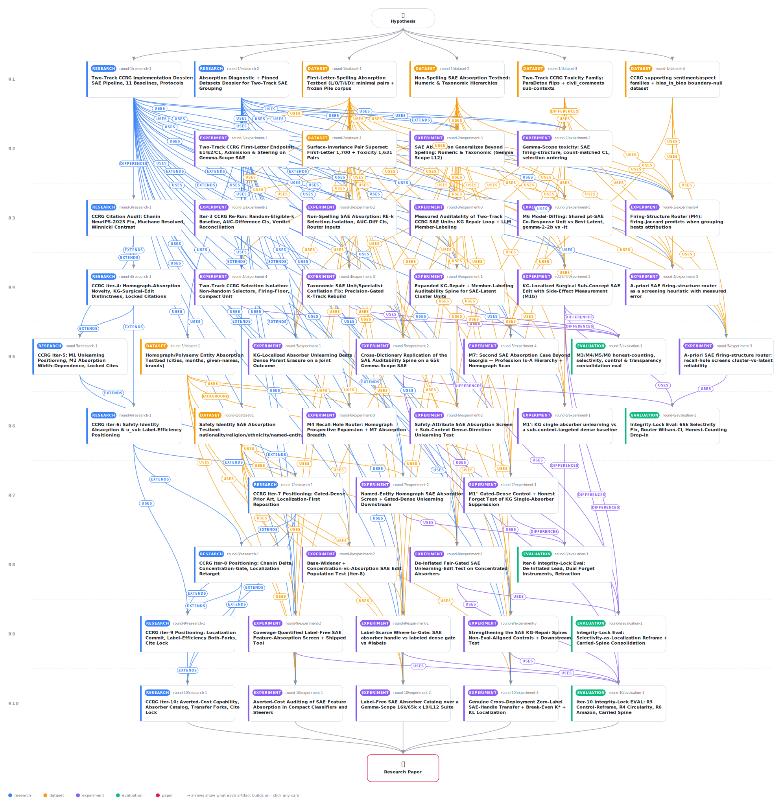

# Catching Silent Feature Absorption in Frozen Sparse Autoencoders: Label-Free Localization, Averted-Cost Auditing, and a Cross-Dictionary Absorber Catalog

<div align="center">

<a href="https://cdn.jsdelivr.net/gh/AMGrobelnik/ai-invention-7ee30c-catching-silent-feature-absorption-in-fr@main/workflow.svg">
<picture>
  <source media="(prefers-color-scheme: dark)" srcset="workflow-dark.svg">
  
</picture>
</a>

<sub>🖱️ <b><a href="https://cdn.jsdelivr.net/gh/AMGrobelnik/ai-invention-7ee30c-catching-silent-feature-absorption-in-fr@main/workflow.svg">Open the interactive diagram</a></b> — every card links to its artifact folder.</sub>

</div>

> **TL;DR** — This paper repositions a frozen-SAE reliability method: the clustering hypothesis is tested and inert, and the durable object is label-free single-specialist localization (anchor on the max-recall parent, read its recall hole to name an under-served sub-context label-free, precision-select the absorber marginal attribution drops). The headline contribution is an averted-cost capability: on a compact SCR/TPP-selected classifier and steerer, absorption silently breaks the absorbed slice (Georgia recall 0.107 vs 0.969), standard tooling misses the absorber (rank 42, oracle blind), the shipped label-free screen catches and names it, and a two-member repair unit recovers recall to ~1.0 and the steer by +5.74, matching a hole-free dense probe while staying sparse. A genuine cross-deployment transfer (fixed id, zero deploy labels) beats an n-label dense gate on 4/5 sub-contexts, removing a prior same-fold circularity, and a 1344-row absorber catalog over four public SAEs ships as a feature-level knowledge graph. Honest ceiling: no SAE unit out-classifies a dense probe, the edit is matched by a fair labeled gate, and absorption is homograph/named-entity-confined (6/110 eligible tokens).

<details>
<summary>Full hypothesis</summary>

ITERATION-10 STATUS -- BOTH NEW LOAD-BEARING PIECES EXECUTED AND LARGELY LANDED, BUT THE REVIEW EXPOSED A NEW PUBLICATION-GATING RIGOR MAJOR AT THE SINGLE MOST-CITED EXAMPLE. The iter-10 mandate's two make-or-break additions both ran: (M1''''') the AVERTED-COST CAPABILITY is DEMONSTRATED on 3/4 arms [art_DBUOXsYIIirp] and the label-free ABSORBER CATALOG is PUBLISHED over a 4-SAE Gemma-Scope suite [art_ofD7h2J_oa-t]; (M2''''') the GENUINE CROSS-DEPLOYMENT ZERO-LABEL TRANSFER is REAL but honestly DE-INFLATED to 4/5 sub-contexts [art_hDsehctoIpVZ], removing the iter-9 same-fold circularity. A $0 integrity-lock eval re-controlled the spine [art_aJIP5OfWUSdO]; positioning is locked [art_76MEbTQyBSbO]. HOWEVER, the paper review surfaced a NEW dominant rigor blocker: the flagship GEORGIA 'label-free catch + name + repair' demonstration SECRETLY PINS the absorber id 16009 -- which the SHIPPED screen and the PUBLISHED catalog do NOT reproduce (their end-to-end label-free derivation returns the weaker feature-split sibling 4697, firing-precision ~0.335) -- so the central LABEL-FREE thesis is compromised precisely where it is asserted most strongly. SIGNIFICANCE remains the persistent structural ceiling: the contribution is intrinsically narrow (clustering null; three goal-named downstream tasks null; no SAE unit out-classifies dense; the edit is matched by a fair labeled gate; 6/110 eligible tokens, demographic attributes never structured; the averted-cost benefit is conditional -- a dense diff-of-means probe never has the hole, which self-closes at N>=10). The honest contribution is unchanged in SUBSTANCE: (i) auditable, label-free, regime-targeted LOCALIZATION of homograph-polysemy absorption (re-controlled, tempered to localization-not-utility); (ii) a quantified CONFINEMENT-COVERAGE result + a shipped label-free SCREEN + a published cross-dictionary CATALOG; (iii) a NAMED-ENTITY averted-cost CAPABILITY (clean label-free for Amazon/Bush/Cook); (iv) a GENUINE de-inflated cross-deployment where-to-gate SAVING (4/5). The iter-11 gate is NO LONGER 'execute a new positive' -- both positives landed -- but 'CLOSE the Georgia integrity gap honestly and MEASURE the one significance axis (auditability) where the SAE beats dense'.

              WHAT LANDED.

              - M1''''' AVERTED-COST CAPABILITY EXECUTED [art_DBUOXsYIIirp], $0 core + $0.0104 judge, overall=AVERTED_COST_DEMONSTRATED (3/4 arms): georgia_classifier (taxonomic, primary), amazon_classifier (named-entity), amazon_steer (primary steer) DEMONSTRATED; large_steer = HN_SCREEN_DESCRIPTIVE_ONLY (honest conservative abstention, ~12 eval windows, n<150 -> screen DECLINES to strict-certify, it abstains it does not miss). Four-beat chain: (a) SILENT FAILURE on the absorbed slice at compact auditable size N=5 -- Georgia country-recall 0.107 vs 0.969 siblings (gap +0.86 CI excl 0), Amazon org-recall 0.087 vs 0.760, Amazon steer on-target margin-drop 1.09 vs 2.96; (b) STANDARD PRACTICE MISSES IT -- the absorber is buried deep in the SCR/TPP marginal-attribution rank (Georgia 16009 r42, Amazon 6846 r14, outside any compact top-N) AND the form-free decoder-projection oracle is BLIND to Georgia (cos -0.024, corroborates=False) while it DOES corroborate Amazon (0.116); (c) the SHIPPED SCREEN CATCHES IT label-free and NAMES the absorber (recall_hole 0.73/0.62); (d) the named-absorber 2-member parent+absorber REPAIR lifts the classifier to ~1.0 (+0.89/+0.91 CI excl 0) and the steer on-target to 6.83 (+5.74). Hole_closes_at_N=10. Non-SAE dense diff-of-means probe has NO slice hole (Georgia 0.99/1.0) -> the hole is an SAE-SELECTION artifact, not a distributed-sense gap, and the repair recovers the compact auditable SAE unit to MATCH the dense baseline while staying sparse. amazon_steer side-effects FREE off-target (KL/PPL/footprint within a firing-rate-matched shuffle null), judge harmonic-mean 0.73->0.78. CRITICAL GOTCHA (the reviewer's MAJOR): the absorber is PINNED to the canonical KG id; the label-free re-derivation PREFERS a weaker split sibling (Georgia discovered_label_free=4697 vs pinned 16009; metadata_screen_discovered_eq_pinned=False), while Amazon/Bush/Cook reproduce label-free (discovered_eq_pinned=True; 6846/9751/15631). So the +0.89 Georgia repair and the transfer handle BOTH use 16009; repair with the actually-derived 4697 (prec 0.335) is NEVER tested.

              - M1''''' ABSORBER CATALOG PUBLISHED [art_ofD7h2J_oa-t], $0, verdict CATALOG_PUBLISHED. 1344 rows = {16k,65k} x {L9,L12} x 336 deduped candidates over 10 hierarchies; each row carries parent/absorber latent, recall-hole, firing-Jaccard, precision, hole-coverage gain + bootstrap CI, random-latent control, predict_absorption verdict, form-free oracle corroboration, anchor provenance, and a Neuronpedia auto-interp label (203 structured rows labeled, $0). The 16k/L12 config REPRODUCES the iter-9 screen BIT-EXACT (336/336 on predict + absorber id). TWO TRENDS (the reviewer demands these be called TRENDS, not LAWS -- n=2 per axis): absorption is MORE prevalent at the EARLIER layer (strict-structured 6->15 at 16k, 3->29 at 65k going L12->L9) and WIDER SAEs surface MORE breadth (relaxed 31->62 at L12; the width direction CORROBORATES prior work, the layer direction is a new 2-layer assertion). STABILITY: of 131 tokens structured somewhere, only 8 are PERSISTENT (>=3 configs; Amazon+Jordan in all 4), 69 CONFIG_SPECIFIC -> absorber ids are dictionary-specific, reliability must be checked PER SAE. KEY for R1: the catalog's positive control for Georgia at 16k/L12 is the DATA-DERIVED 4697 (data-derived == expected) -- so catalog.csv and the screen agree on 4697, while the averted-cost/transfer headlines use 16009. The decoder oracle corroborates lexical/named-entity (0.90) but under-fires for the taxonomic 'country' direction (0.5).

              - M2''''' GENUINE CROSS-DEPLOYMENT TRANSFER EXECUTED [art_hDsehctoIpVZ], $0.054, verdict REAL_WHERE_TO_GATE_SAVING (de-inflated from iter-9's blanket 5/5). FIXES the iter-9 circularity: the absorber id is FIXED on deployment A (where discovered), then on a DISJOINT deployment B the n-independent fixed-id SAE firing gate (0 deploy labels) is scored against a FRESH dense fair gate fit on B's OWN n labels (n in {1,5,20,full}), with B_eval disjoint from A and from B_fit. On the held-out corpus split B, transfer is CONFIRMED (dense n=1 CI-separated below the SAE handle ~1.0) for Georgia (1.000), United States (0.986), Amazon (0.999); Jordan FLIPS to NO_TRANSFER (handle only 0.955 -> noisy n=1 dense CI overlaps); first_letter 'large' UNDERPOWERED on B (7 eval positives) but TRANSFER_CONFIRMED on the carrier-shift axis C. The A_eval contrast reproduces iter-9 EXACTLY, proving the only change is the non-circular B deployment. Break-even K* = D/n*: Georgia 150, US 600, Amazon ~70. D_min cheap-rediscovers the absorber for Jordan (20) and large (10) but NOT Georgia/US/Amazon (label-frugal re-derivation picks a weaker split sibling = honest feature-splitting signal -> the catalog's pre-computed id is the load-bearing value for those). Selection-INDEPENDENT behavioral next-token-KL targeting is LOCALIZED for Amazon/Georgia/Jordan/US (exceeds random-latent null) but NULL for 'large' (a random spelling latent dominates the null) -- the OPPOSITE split from firing-balacc, an honest reportable negative. Amazon edit caveat = MATERIAL_REPORT_BOTH (judged forget gap 0.875; adv_pres(full)=0 reproduces the iter-9 anchor while adv_joint(full)=+0.52/+0.68 excl 0 = a real instrument disagreement) -> SOFTEN 'demonstrated' to PRESERVATION-ADVANTAGE-ONLY for Amazon; large caveat ISOLATED_IMMATERIAL. NOTE for R1: the Georgia transfer handle ALSO uses the pinned 16009.

              - INTEGRITY-LOCK EVAL [art_aJIP5OfWUSdO], 80 cross-checks (68 PASS recompute-match + 10 CARRIED + 2 FINDINGS + 0 unexpected). R3 control-reframe (re-runs BH over JUST the two INFORMATIVE selectors S-mag/S-rec): KG beats BOTH at FDR<=0.05 on 16/24 holes (spelling 13/21, taxonomic 3/3); the two dense decoder-projection controls resolve to the parent/anchor on 24/24 (gain 0) = VACUOUS-BY-CONSTRUCTION; numeric non-triviality 6/7 (controls genuine); precision_specific=False (coverage not precision-magic); Georgia S-mag recovers 0.453 of the hole yet beaten +0.347; downstream NULL_TEMPER (dense probe out-recalls the repaired unit on 4/5 concepts). Selectivity 16k median 1262x/mean 1452x, denominator IS the disowned DENSE-WHOLE strawman (footprint 1.0 on all 6); fair gate 2.79e-6 cleaner than KG 5.07e-5 (adv_KG_vs_FAIR CI incl 0, adv_KG_vs_SUB +0.97). 30 FDR survivors, 24 distinct holes (FINDING: supersedes carried 22, 6 second-variants); 65k corrected MEDIAN ~676x (NEVER 466997x divide-by-eps, mean floor-recipe-dependent); cross-dict 65k full / layer-9 partial; coverage 6/110 (Wilson [0.025,0.114]); safety 2/44, named-entity 3/5, professions 0/28, router DEMOTED, model-diffing +0.000, clustering inert 0/8.

              - POSITIONING [art_76MEbTQyBSbO]: pre-wrote both forks for the averted-cost and transfer experiments (now resolved to AVERTED_COST_DEMONSTRATED + TRANSFER_CONFIRMED); grounds the averted-cost beat (SCR/TPP silently drops the absorber by construction; the screen names it where the contested decoder-cosine proxy is blind; Chanin 'Are SAE Benchmarks Reliable?' calls the proxy unreliable) and the catalog as an INTERVENTIONAL feature-KG invisible to Winnicki's OBSERVATIONAL co-occurrence KG; citation table locked.

              WHAT THE ITER-10 REVIEW EXPOSED -- TWO MAJORS THAT GATE PUBLICATION, PLUS FOUR MINORS.
                (R1, RIGOR -- the NEW #1 blocker) THE FLAGSHIP GEORGIA 'LABEL-FREE' DEMONSTRATION IS PINNED-ID-CIRCULAR. The shipped screen and the published catalog return Georgia's 16k/L12 absorber as 4697 (a weak high-coverage feature-split sibling, precision ~0.335), but the abstract, intro, Section 5(c-d), Section 8 and the conclusion present Georgia with absorber 16009 and the repair (+0.893 -> recall 1.0) + transfer handle (SAE 1.000) BOTH use 16009. The averted-cost code records discovered_label_free=4697 and screen_discovered_eq_pinned=False for Georgia, then OVERRIDES to the canonical 16009 ('the published id is reproducible + oracle-pinned'). Repair with the actually-derived 4697 is NEVER tested. Amazon/Bush/Cook DO reproduce label-free, so the issue is SCOPED to the single most-cited example -- but that is exactly where the label-free thesis is asserted most strongly, and Section 7 already honestly discloses the feature-split issue for transfer while Section 5/abstract/Section 8 do not. => ITER-11 MUST EITHER (a) RE-RUN the Georgia averted-cost repair (classifier + steer) AND the transfer handle with the SCREEN-RETURNED id 4697 and report ALL THREE outcomes -- recall lift, SIBLING COLLATERAL (the load-bearing risk: 4697's low precision may break the clean zero-collateral property), and held-out generalization -- with bootstrap CIs; if 4697 still repairs to ~1.0 with negligible sibling collateral, the label-free claim is VINDICATED end-to-end and the pin is DROPPED; if it lifts recall but adds collateral or fails, that IS the honest result; OR (b) EXPLICITLY DISCLOSE in Section 5, the abstract, and Section 8 that the Georgia headline absorber is CANONICAL-PINNED (traceable to supervised/oracle discovery) and that the end-to-end label-free pipeline yields a weaker split sibling, and SHIFT the flagship label-free demonstration to AMAZON (which reproduces label-free). IN BOTH CASES: reconcile catalog.csv (4697) vs paper (16009) to AGREE on Georgia's id, and reconcile the method's precision-select PROSE (selects 16009 at precision 0.955) with the DEPLOYED screen_candidate selection that returns 4697.
                (R2, SCOPE/SIGNIFICANCE -- the persistent dominant blocker) THE CONTRIBUTION IS INTRINSICALLY NARROW AND THE AVERTED-COST BENEFIT IS CONDITIONAL. A practitioner who simply uses the dense diff-of-means probe (the strongest detector, conceded) NEVER has the hole, and the hole self-closes at N>=10, so the benefit applies ONLY to a practitioner who specifically wants a COMPACT (k<=5) AUDITABLE SAE-latent artifact -- a genuine but narrow niche. => ITER-11 MUST LEAN THE SIGNIFICANCE CASE EXPLICITLY AND QUANTITATIVELY ON AUDITABILITY -- the ONE axis where the SAE handle BEATS the dense probe: DEFINE and MEASURE the auditability the dense hyperplane lacks (k<=2 latents each with logit-lens labels + the already-measured member-labeling agreement 0.730 vs 0.096 null; the dense difference-of-means direction is a single opaque 2304-dim vector with no decomposable nameable members; the N>=10 raw-latent ensemble that closes the hole has low per-member interpretability and still buries the absorber at rank 42) so 'the cost is the compactness you give up' becomes a MEASURED tradeoff, not a rhetorical one. POSITION the screen+catalog as the PRIMARY reusable contribution (a label-free reliability/auditing instrument + feature-KG over a public suite) and the averted-cost story as ONE concrete instantiation. BE UPFRONT IN THE ABSTRACT that the actionable result is a reliability/auditing instrument for a CONFINED homograph/named-entity regime, NOT a general improvement over dense baselines.
                (R3, EVIDENCE -- minor) The +0.893 averted-cost repair magnitude is close to TAUTOLOGICAL as a headline (adding a latent that, by selection, fires on held-out Georgia-positive tokens mechanically lifts recall toward 1.0); it compounds with R1 (it uses 16009). => Reframe the averted-cost headline around DETECTION-where-standard-tooling-fails (attribution rank 42, decoder-oracle blind) + ZERO-COLLATERAL repair; report +0.893 as CONFIRMATION that the named absorber generalizes to the held-out fold, not as the primary benefit; foreground the rank-42 + oracle-blind facts (the surprising content).
                (R4, RIGOR -- minor) The 'two dictionary laws' are inferred from a 2x2 grid (n=2 per axis). => Soften to 'two consistent TRENDS across the four configs'; cite the WIDTH trend as CORROBORATING prior work (SAEBench/Chanin width-absorption law), and either add at least one intermediate layer/width to the catalog OR explicitly state the n=2-per-axis limitation for the new LAYER claim.
                (R5, NOVELTY -- minor) The core operator (anchor on highest-recall parent, read the recall hole, precision-select the absorber) reads as an incremental label-free RELABELING of Chanin's already-published absorption diagnostic (the absorber object is the same). => RE-CENTER the novelty narrative on the label-free SCREEN + cross-dictionary CATALOG as the genuinely novel, shipped, reusable reliability instrument; present the operator as the MECHANISM that enables them; make the delta-vs-Chanin crisp -- ONE sentence on what is identical (the absorber), ONE on what is new (it is found label-free/training-free/form-free over hierarchies the diagnostic was never applied to, and SHIPPED as a tool over a public suite).
                (R6, CLARITY -- minor) The abstract/intro pack 3+ statistics per sentence; contribution bullets carry multiple parenthetical numbers. => Cut quantitative anchors in the abstract to ONE per claim; lead the intro with a one-sentence thesis; trim the contribution list to FOUR crisp items each with a single load-bearing number; let the body carry the caveats.

              THE ITERATION-11 MANDATE (the GEORGIA INTEGRITY FIX and the MEASURED-AUDITABILITY/SIGNIFICANCE-RECENTER are the two make-or-break pieces; the minors are cleanup; if the Georgia re-run shows 4697 does NOT cleanly repair, the paper stands as a NAMED-ENTITY averted-cost + screen + catalog + localization paper with Georgia disclosed as canonical-pinned -- itself publishable).
                (M1'''''' = NEW LOAD-BEARING #1 -- GEORGIA INTEGRITY FIX, R1). Re-run the Georgia averted-cost repair (classifier + steer) AND the cross-deployment transfer handle with the SCREEN-RETURNED label-free id 4697; report recall lift, sibling collateral, and held-out generalization with bootstrap CIs. FORK: clean repair (recall ~1.0, negligible sibling collateral, CI excl 0) => LABEL-FREE VINDICATED end-to-end, DROP the pin, keep Georgia as the flagship; NOT clean (recall up but collateral up, or fails) => HONEST result, DISCLOSE Georgia as canonical-pinned and shift the clean label-free flagship to AMAZON (Bush/Cook screen-only). EITHER WAY reconcile catalog.csv vs paper on Georgia's id and reconcile the precision-select prose with the deployed screen_candidate (4697).
                (M2'''''' = NEW LOAD-BEARING #2 -- MEASURED AUDITABILITY + SIGNIFICANCE RECENTER, R2). Define and MEASURE the auditability axis where the SAE beats dense (k<=2 logit-lens-labeled, LLM-nameable latents at member-labeling agreement 0.730 vs 0.096 null, vs a single opaque dense direction; quantify the interpretability cost of the N>=10 raw-latent ensemble that closes the hole). Recenter the paper so the SCREEN+CATALOG are the PRIMARY reusable contribution and the averted-cost is ONE instantiation; state in the abstract that the actionable result is a CONFINED-regime reliability/auditing instrument, not a general dense-beating method.
                (M3'''''' = AVERTED-COST DETECTION-FIRST REFRAME, R3). Lead with label-free DETECTION (rank-42, oracle-blind) + zero-collateral repair; report +0.893 as held-out-generalization confirmation, not the primary benefit.
                (M4'''''' = DICTIONARY TRENDS NOT LAWS, R4). 'Two consistent trends across four configs'; width corroborates prior work; add an intermediate layer/width or state the n=2-per-axis limitation for the layer claim.
                (M5'''''' = NOVELTY RECENTER ON SCREEN+CATALOG, R5). Foreground the shipped label-free screen + cross-dictionary catalog; operator as enabling mechanism; one-sentence-each Chanin delta.
                (M6'''''' = CLARITY/PRESENTATION, R6). One stat per abstract claim; one-sentence intro thesis; four crisp contributions; rebuttal scaffolding stays in the appendix changelog.
                (M7'''''' = CARRIED INTEGRITY). Carry the re-controlled spine [KG beats S-mag/S-rec at FDR 16/24; dense controls vacuous-by-construction; 30 FDR survivors / 24 distinct holes (supersedes 22); precision_specific=False; downstream NULL_TEMPER; selectivity-as-localization (denominator = disowned DENSE-WHOLE strawman; fair gate cleaner); 16k median 1262x, 65k median ~676x NEVER 466997x; cross-dict 65k full / layer-9 partial] [art_aJIP5OfWUSdO, art_mHCB4FyqyMXL, art_A8o1h4sWckjw, art_4L1MZxvWYlGd]; the settled safety null (2/44 homograph; named-entity 3/5) [art_yAQgbq5Wgymx, art_ZxVw0e4seBq3, art_NIxb2uUvT-ze]; coverage 6/110; router DEMOTED [art_F_-HUhl0NR_i]; clustering INERT (0/8) and all three goal-named downstream tasks NULL; numeric below editing gate; member-labeling 0.730 vs 0.096. Strip iteration/rebuttal scaffolding.

              RE-DESIGNATED HEADLINE (screen+catalog FIRST as the reusable instrument; averted-cost + transfer as concrete instantiations; auditability as the measured significance axis). On a FROZEN public SAE, anchored recall-hole-guided PRECISION SELECTION is a TRAINING-FREE, LABEL-FREE DISCOVERY PROCEDURE that surfaces the single PRECISE sub-context latent a marginal-attribution ranking silently drops -- shipped as a label-free SCREEN and a 1344-row cross-dictionary CATALOG (a feature-level KNOWLEDGE GRAPH whose interventional recall-hole edges are invisible to observational co-occurrence/geometry KGs). The build-on capability is AVERTED COST: a practitioner who ships a compact SCR/TPP-selected classifier/steerer silently fails on an absorbed slice (attribution rank 42, decoder-oracle blind), the shipped screen CATCHES + NAMES the absorber label-free, and a 2-member parent+absorber repair recovers recall with NEAR-ZERO sibling collateral -- DEMONSTRATED cleanly for NAMED-ENTITY Amazon (Bush/Cook screen-confirmed); GEORGIA is CONTINGENT on the iter-11 4697 re-run (the screen returns 4697, not the headlined 16009). The where-to-gate SAVING is REAL and DE-INFLATED: a FIXED absorber id transfers ZERO-LABEL to a DISJOINT deployment B and beats an n-label dense gate on 4/5 sub-contexts (Jordan NO_TRANSFER honest), with break-even K* reported and the n=5 dense point as the honest practical comparison. The unique value the SAE handle has over a dense probe is AUDITABILITY (k<=2 named latents at member-labeling 0.730 vs 0.096 null), NOT classification or downstream recall (a dense probe out-recalls the repaired unit on 4/5 concepts and has NO hole). CLUSTERING is TESTED-AND-NEGATIVE (multi-member grouping INERT 0/8 for the edit; ties weak baselines for classification). Gating is ESTABLISHED PRIOR ART (CAST/GSS/GUARD-IT/SADI, all SUPERVISED); the SAE-specific value is the LABEL-FREE discovery of WHERE to gate + the AVERTED downstream failure standard practice misses. SAFETY-relevant absorption is HOMOGRAPH-CONFINED (2/44; 6/110 eligible polysemous tokens; religion/ethnicity/months never structured) -- the SETTLED ceiling and deliberate boundary.

              PRIMARY ENDPOINT (re-designated for iter-11).
                (a) GEORGIA INTEGRITY (NEW LOAD-BEARING #1, M1''''''): the Georgia averted-cost + transfer re-run with the screen-returned 4697 either VINDICATES label-free end-to-end (drop pin) or yields an HONEST disclosure (Georgia canonical-pinned, flagship shifts to Amazon); catalog and paper reconciled on Georgia's id. FORK decides whether Georgia stays the flagship.
                (b) MEASURED AUDITABILITY + SIGNIFICANCE RECENTER (NEW LOAD-BEARING #2, M2''''''): a MEASURED auditability tradeoff (the SAE unit's k<=2 named latents at member-labeling 0.730 vs a dense single opaque direction), screen+catalog positioned as the primary reusable contribution, abstract scoped to a confined-regime reliability instrument.
                (c) AVERTED-COST CAPABILITY (ACHIEVED, 3/4 arms): silent failure -> standard practice misses -> screen catches+names -> 2-member repair, DEMONSTRATED cleanly for Amazon; Georgia contingent on (a); large_steer honest abstention [art_DBUOXsYIIirp].
                (d) GENUINE WHERE-TO-GATE TRANSFER (ACHIEVED, 4/5): fixed-id zero-label transfer beats n-label dense on a disjoint B; Jordan NO_TRANSFER; K* reported; selection-independent behavioral-KL localized for 4/5 (null for large) [art_hDsehctoIpVZ].
                (e) AUDITABILITY/LOCALIZATION SPINE (ACHIEVED, re-controlled): KG beats S-mag/S-rec on 16/24 at FDR (parent-argmax controls vacuous-by-construction); coverage not precision-magic; downstream NULL -> tempered; selectivity as localization; member-labeling 0.730 vs 0.096; cross-dict 65k full / layer-9 partial [art_mHCB4FyqyMXL, art_aJIP5OfWUSdO, art_A8o1h4sWckjw, art_4L1MZxvWYlGd].
                (f) CONFINEMENT COVERAGE + SCREEN + CATALOG (ACHIEVED): 6/110 = 5.5% strict (Wilson [0.025,0.114]); homograph/named-entity-confined; demographic never; shipped screen.py; 1344-row catalog over 4 SAEs; oracle corroborates 27/31 [art_NIxb2uUvT-ze, art_ofD7h2J_oa-t].
                (g) SAFETY SCOPE (SETTLED NULL): homograph-confined (2/44; named-entity 3/5) [art_yAQgbq5Wgymx, art_ZxVw0e4seBq3].
                (h) ROUTER: recall-hole reproduces on derivation (bal-acc 1.0) but OUT-OF-SAMPLE-UNVALIDATED -- DEMOTED [art_F_-HUhl0NR_i].
              SUPPORTING (strengthen, do not gate): within-SAE precision selection (Georgia, I, D); the steering demo (L,D); the homograph/coverage breadth count; the catalog layer/width trends. The headline NO LONGER depends on classification beating dense, on multi-member grouping, on the router being validated, on a safety win, on the edit beating a fair conditional dense control, NOR on the Georgia repair being end-to-end label-free unless the 4697 re-run confirms it.

              THE DISCOVERY ALGORITHM (framed as LABEL-FREE SINGLE-SPECIALIST LOCALIZATION; the operator is the MECHANISM, the screen+catalog are the shipped novelty). STEP 1 cover-based eligibility (content-responsive above a shuffle null; firing-precision>=0.7; covers>=1 sub-context). STEP 2 ANCHOR = argmax cover-set chosen WITHOUT the diagnostic, with the unsupervised firing-floor parent-validation (anchor fires on held-out corpus above ~5%). STEP 3 HOLE = parent's uncovered pairs (names the under-served sub-context, label-free). STEP 4 PRECISION-SELECT the single absorber covering the hole (held-out precision>=0.7, firing-Jaccard<0.1, marginal-gain>=0.05 CI excl 0). NOTE the iter-11 RECONCILIATION REQUIREMENT: the deployed screen_candidate returns Georgia 4697 (high-coverage split sibling) while the prose claims 16009 -- iter-11 must make the prose match what the shipped code returns, or pin-and-disclose. The localization-arm metric (balanced-accuracy) is CLOSE to the selection criterion -- report the coincidence and lean on held-out generalization + the selection-INDEPENDENT behavioral-KL (localized 4/5, null for large). Set-cover/(1-1/e) is MOTIVATION only (INERT vs max-precision for the edit). C-TRACK clustering: TESTED-AND-NEGATIVE, reported as a null not a contribution.

              BASELINE GLOSSARY. LOCALIZATION/REPAIR controls (decisive): S-mag and S-rec = the TWO INFORMATIVE label-free selectors the KG must beat; dense-probe decoder-projection argmax (JTT + diff-of-means) = VACUOUS-BY-CONSTRUCTION (resolve to the parent). EDIT comparators: KG-ABL (discovered absorber, ZERO sub-context labels at deploy); DENSE-SUB-ABL (strongest UNGATED dense, LEAD); DENSE-SUB-ABL-GATED-FAIR (precise logistic d_sub gate, beta<=1 -- the fair control that CLOSED the gap); DENSE-SUB-ABL-GATED footprint-gated (DEMOTED, robustness caveat only); MAX-PRECISION single latent (ablation: discovery INERT for the edit); DENSE-WHOLE-ABL (disowned selectivity-denominator strawman). AVERTED-COST: SCR/TPP marginal-attribution selection = the 'standard practice' that silently drops the absorber; the dense diff-of-means probe = the strong non-SAE baseline with NO hole (so the SAE value is auditability+compactness, NOT recall). AUDITABILITY (the iter-11 significance axis): the SAE 2-member unit's per-latent logit-lens labels + member-labeling agreement vs the dense direction's single opaque vector.

              NON-SPELLING / HOMOGRAPH TESTBED. Absorption recurs on HOMOGRAPH/POLYSEMOUS tokens whose general parent is suppressed -- taxonomic Georgia (the lone taxonomic-country structured case, and the contested label-free one); named-entity Amazon/Bush/Cook (label-free reproducing); US CO-FIRING; 0/28 professions; months NO_HOLE; of 44 safety groups only 2 homographs. A structured absorber is an EDITABLE handle only if its targeted sense is LEXICALLY CONCENTRATED (spelling 'large', entity 'Amazon'; DISTRIBUTED country senses Georgia/Jordan do NOT meaningfully forget). A non-SAE dense probe matches/beats the unit on ALL classification and has NO hole.

              SCOPE AND VALUE PROPOSITION. The defensible contribution is: (1) a SHIPPED label-free SCREEN + 1344-row cross-dictionary CATALOG = a reusable reliability/auditing instrument + feature-KG over a public SAE suite (the PRIMARY novelty, per R2/R5); (2) an AVERTED-COST capability (the screen catches a silent absorption-induced downstream failure standard practice misses; the named absorber repairs it) DEMONSTRATED cleanly for named-entity, Georgia contingent on the 4697 re-run; (3) a GENUINE de-inflated cross-deployment where-to-gate SAVING (4/5); (4) a TRAINING-FREE label-free single-specialist LOCALIZATION procedure with a MEASURED auditable feature-KG, the ONE axis the SAE beats dense. The method does NOT out-classify a strong dense probe, does NOT beat a fair conditional dense control on the edit, the clustering machinery is INERT, the Georgia label-free derivation returns a weaker split sibling than headlined, and the regime is confined (6/110).

              HONEST NEGATIVES (each publishable): the Georgia 'label-free' flagship is PINNED-ID-CIRCULAR (screen+catalog return 4697 prec 0.335, not the headlined 16009; repair with 4697 untested) -- iter-11 must vindicate or disclose; the genuinely-fair bounded-beta d_sub-gated dense control CLOSES the edit gap on every case (0/8 KG-beats-both) and is cleaner on collateral; the iter-9 label-scarce 'demonstration' was CIRCULAR (now superseded by the genuine transfer, itself de-inflated to 4/5 with Jordan NO_TRANSFER); the averted-cost benefit is CONDITIONAL (dense probe never has the hole, hole self-closes at N>=10); the +0.893 repair is near-by-construction (selection mechanically lifts recall); the catalog 'laws' are 2-per-axis TRENDS; the downstream-capability test is a NULL (dense out-recalls on 4/5); the set-cover discovery is INERT vs max-precision (0/8); the clustering/multi-member hypothesis did NOT pay off; the edit-win predictor is CONCENTRATION not absorption; iter-6's Georgia +0.561 RETRACTED as near-NOOP; the +1.58-vs-gated headline was inflated to +1.00; the Amazon adv_joint does not converge at full labels (instrument-disagreement -> preservation-advantage-only); gating is established prior art; no SAE unit out-classifies a dense probe; all three goal-named downstream tasks are NULLS; safety absorption is homograph-confined (2/44; 6/110); 0/28 professions; the router is at chance out-of-sample; cross-dictionary replicates at 4x width but only PARTIALLY across a layer; the 65k 466997x was a divide-by-epsilon artifact (use median ~676x); numeric is below-gate. A clean iter-11 where the 4697 re-run shows the screen-returned id does NOT cleanly repair Georgia = 'the end-to-end label-free pipeline yields a weaker split sibling for the taxonomic case' and the flagship shifts to Amazon -- the paper becomes a named-entity averted-cost + screen + catalog + localization paper, itself publishable.

              MOTIVATION (substance unchanged). Single SAE latents are unreliable units: absorption (Chanin 2409.14507), splitting, hedging (2505.11756), 'SAEs Do Not Find Canonical Units' (ICLR 2025) converge on no single latent reliably tracking a concept; AxBench (ICML 2025) and DeepMind's negative report show diff-of-means beats raw-latent SAE methods, and the field's own SCR/TPP proxies are contested (Chanin 'Are SAE Benchmarks Reliable?'). Absorption is the regime where OBSERVATIONAL signals break by construction and MARGINAL-ATTRIBUTION selection silently drops the absorber; anchored recall-hole-guided precision selection recovers it LABEL-FREE and SHIPS it as a screen+catalog -- the durable, transferable deliverable. The method positions against 'use SAEs to DISCOVER, not to ACT' (Peng 2506.23845): CCRG DISCOVERS the sub-context handle and the silent failure it causes; ACTING through it is no better than a fair labeled dense gate; the load-bearing open questions iter-11 must answer are whether the Georgia DISCOVERY is genuinely label-free end-to-end, and whether the AUDITABILITY the SAE unit uniquely provides is a MEASURED (not rhetorical) advantage over dense.

              SUCCESS CRITERIA. CONTRIBUTION CONFIRMED iff: (LOAD-BEARING) (M1'''''') the Georgia averted-cost + transfer re-run with the screen-returned 4697 EITHER vindicates label-free end-to-end (clean repair, drop pin) OR yields an honest disclosure (Georgia canonical-pinned, flagship -> Amazon), with catalog and paper reconciled; AND (M2'''''') a MEASURED auditability tradeoff is reported (the one axis SAE beats dense) and the screen+catalog are positioned as the primary reusable contribution with an abstract scoped to a confined-regime instrument; AND the re-controlled localization spine holds (KG beats S-mag/S-rec on 16/24 at FDR, coverage-not-precision, downstream-null-tempered); AND the averted-cost (3/4, cleanly label-free at least for Amazon), the genuine transfer (4/5), the coverage/screen/catalog, the safety null, and the clustering-inert null are reported as deliberate findings. SUPPORTING (strengthen, do not gate): within-SAE precision selection (Georgia, I, D); member-labeling above null; the steering demo (L,D); the coverage breadth count; the catalog layer/width trends. HONEST NEGATIVES cap-but-do-not-sink: the 4697 re-run showing Georgia needs the oracle-pinned id (flagship -> Amazon), the edit not beating a fair conditional control, near-NOOP forget for distributed senses, safety absorption absent, router-at-chance, layer-conditional replication, clustering inert, no classification win over dense, Jordan no-transfer.

</details>

[](https://cdn.jsdelivr.net/gh/AMGrobelnik/ai-invention-7ee30c-catching-silent-feature-absorption-in-fr@main/paper.pdf) [](https://github.com/AMGrobelnik/ai-invention-7ee30c-catching-silent-feature-absorption-in-fr/tree/main/paper_latex)

This repository contains all **52 artifacts** produced across **10 rounds** of an autonomous AI research run — round by round, exactly in the order they were invented.

## Round 1

| Artifact | Type | Demo | Source | Builds on |
|----------|------|------|--------|-----------|
| **[Two-Track CCRG Implementation Dossier: SAE Pipeline, 11 Base…](https://github.com/AMGrobelnik/ai-invention-7ee30c-catching-silent-feature-absorption-in-fr/tree/main/round-1/research-1)** | [](https://github.com/AMGrobelnik/ai-invention-7ee30c-catching-silent-feature-absorption-in-fr/tree/main/round-1/research-1) | [](https://github.com/AMGrobelnik/ai-invention-7ee30c-catching-silent-feature-absorption-in-fr/blob/main/round-1/research-1/demo/research_demo.md) | [](https://github.com/AMGrobelnik/ai-invention-7ee30c-catching-silent-feature-absorption-in-fr/tree/main/round-1/research-1/src) | — |
| **[Absorption Diagnostic + Pinned Datasets Dossier for Two-Trac…](https://github.com/AMGrobelnik/ai-invention-7ee30c-catching-silent-feature-absorption-in-fr/tree/main/round-1/research-2)** | [](https://github.com/AMGrobelnik/ai-invention-7ee30c-catching-silent-feature-absorption-in-fr/tree/main/round-1/research-2) | [](https://github.com/AMGrobelnik/ai-invention-7ee30c-catching-silent-feature-absorption-in-fr/blob/main/round-1/research-2/demo/research_demo.md) | [](https://github.com/AMGrobelnik/ai-invention-7ee30c-catching-silent-feature-absorption-in-fr/tree/main/round-1/research-2/src) | — |
| **[First-Letter-Spelling Absorption Testbed (L/O/T/I/D): minima…](https://github.com/AMGrobelnik/ai-invention-7ee30c-catching-silent-feature-absorption-in-fr/tree/main/round-1/dataset-1)** | [](https://github.com/AMGrobelnik/ai-invention-7ee30c-catching-silent-feature-absorption-in-fr/tree/main/round-1/dataset-1) | [](https://colab.research.google.com/github/AMGrobelnik/ai-invention-7ee30c-catching-silent-feature-absorption-in-fr/blob/main/round-1/dataset-1/demo/data_code_demo.ipynb) | [](https://github.com/AMGrobelnik/ai-invention-7ee30c-catching-silent-feature-absorption-in-fr/tree/main/round-1/dataset-1/src) | — |
| **[Non-Spelling SAE Absorption Testbed: Numeric & Taxonomic Hie…](https://github.com/AMGrobelnik/ai-invention-7ee30c-catching-silent-feature-absorption-in-fr/tree/main/round-1/dataset-2)** | [](https://github.com/AMGrobelnik/ai-invention-7ee30c-catching-silent-feature-absorption-in-fr/tree/main/round-1/dataset-2) | [](https://colab.research.google.com/github/AMGrobelnik/ai-invention-7ee30c-catching-silent-feature-absorption-in-fr/blob/main/round-1/dataset-2/demo/data_code_demo.ipynb) | [](https://github.com/AMGrobelnik/ai-invention-7ee30c-catching-silent-feature-absorption-in-fr/tree/main/round-1/dataset-2/src) | — |
| **[Two-Track CCRG Toxicity Family: ParaDetox flips + civil_comm…](https://github.com/AMGrobelnik/ai-invention-7ee30c-catching-silent-feature-absorption-in-fr/tree/main/round-1/dataset-3)** | [](https://github.com/AMGrobelnik/ai-invention-7ee30c-catching-silent-feature-absorption-in-fr/tree/main/round-1/dataset-3) | [](https://colab.research.google.com/github/AMGrobelnik/ai-invention-7ee30c-catching-silent-feature-absorption-in-fr/blob/main/round-1/dataset-3/demo/data_code_demo.ipynb) | [](https://github.com/AMGrobelnik/ai-invention-7ee30c-catching-silent-feature-absorption-in-fr/tree/main/round-1/dataset-3/src) | — |
| **[CCRG supporting sentiment/aspect families + bias_in_bios bou…](https://github.com/AMGrobelnik/ai-invention-7ee30c-catching-silent-feature-absorption-in-fr/tree/main/round-1/dataset-4)** | [](https://github.com/AMGrobelnik/ai-invention-7ee30c-catching-silent-feature-absorption-in-fr/tree/main/round-1/dataset-4) | [](https://colab.research.google.com/github/AMGrobelnik/ai-invention-7ee30c-catching-silent-feature-absorption-in-fr/blob/main/round-1/dataset-4/demo/data_code_demo.ipynb) | [](https://github.com/AMGrobelnik/ai-invention-7ee30c-catching-silent-feature-absorption-in-fr/tree/main/round-1/dataset-4/src) | — |

## Round 2

| Artifact | Type | Demo | Source | Builds on |
|----------|------|------|--------|-----------|
| **[Two-Track CCRG First-Letter Endpoint: E1/E2/C1, Admission & …](https://github.com/AMGrobelnik/ai-invention-7ee30c-catching-silent-feature-absorption-in-fr/tree/main/round-2/experiment-1)** | [](https://github.com/AMGrobelnik/ai-invention-7ee30c-catching-silent-feature-absorption-in-fr/tree/main/round-2/experiment-1) | [](https://colab.research.google.com/github/AMGrobelnik/ai-invention-7ee30c-catching-silent-feature-absorption-in-fr/blob/main/round-2/experiment-1/demo/method_code_demo.ipynb) | [](https://github.com/AMGrobelnik/ai-invention-7ee30c-catching-silent-feature-absorption-in-fr/tree/main/round-2/experiment-1/src) | <sub><i>uses:</i><br/>[dataset‑1&nbsp;(R1)](https://github.com/AMGrobelnik/ai-invention-7ee30c-catching-silent-feature-absorption-in-fr/tree/main/round-1/dataset-1)<br/>[research‑1&nbsp;(R1)](https://github.com/AMGrobelnik/ai-invention-7ee30c-catching-silent-feature-absorption-in-fr/tree/main/round-1/research-1)<br/>[research‑2&nbsp;(R1)](https://github.com/AMGrobelnik/ai-invention-7ee30c-catching-silent-feature-absorption-in-fr/tree/main/round-1/research-2)</sub> |
| **[Gemma-Scope toxicity: SAE firing-structure, count-matched C1…](https://github.com/AMGrobelnik/ai-invention-7ee30c-catching-silent-feature-absorption-in-fr/tree/main/round-2/experiment-2)** | [](https://github.com/AMGrobelnik/ai-invention-7ee30c-catching-silent-feature-absorption-in-fr/tree/main/round-2/experiment-2) | [](https://colab.research.google.com/github/AMGrobelnik/ai-invention-7ee30c-catching-silent-feature-absorption-in-fr/blob/main/round-2/experiment-2/demo/method_code_demo.ipynb) | [](https://github.com/AMGrobelnik/ai-invention-7ee30c-catching-silent-feature-absorption-in-fr/tree/main/round-2/experiment-2/src) | <sub><i>differences:</i><br/>[dataset‑3&nbsp;(R1)](https://github.com/AMGrobelnik/ai-invention-7ee30c-catching-silent-feature-absorption-in-fr/tree/main/round-1/dataset-3)<br/><i>uses:</i><br/>[research‑1&nbsp;(R1)](https://github.com/AMGrobelnik/ai-invention-7ee30c-catching-silent-feature-absorption-in-fr/tree/main/round-1/research-1)<br/>[research‑2&nbsp;(R1)](https://github.com/AMGrobelnik/ai-invention-7ee30c-catching-silent-feature-absorption-in-fr/tree/main/round-1/research-2)</sub> |
| **[SAE Absorption Generalizes Beyond Spelling: Numeric & Taxono…](https://github.com/AMGrobelnik/ai-invention-7ee30c-catching-silent-feature-absorption-in-fr/tree/main/round-2/experiment-3)** | [](https://github.com/AMGrobelnik/ai-invention-7ee30c-catching-silent-feature-absorption-in-fr/tree/main/round-2/experiment-3) | [](https://colab.research.google.com/github/AMGrobelnik/ai-invention-7ee30c-catching-silent-feature-absorption-in-fr/blob/main/round-2/experiment-3/demo/method_code_demo.ipynb) | [](https://github.com/AMGrobelnik/ai-invention-7ee30c-catching-silent-feature-absorption-in-fr/tree/main/round-2/experiment-3/src) | <sub><i>uses:</i><br/>[dataset‑2&nbsp;(R1)](https://github.com/AMGrobelnik/ai-invention-7ee30c-catching-silent-feature-absorption-in-fr/tree/main/round-1/dataset-2)<br/>[research‑1&nbsp;(R1)](https://github.com/AMGrobelnik/ai-invention-7ee30c-catching-silent-feature-absorption-in-fr/tree/main/round-1/research-1)<br/><i>extends:</i><br/>[research‑2&nbsp;(R1)](https://github.com/AMGrobelnik/ai-invention-7ee30c-catching-silent-feature-absorption-in-fr/tree/main/round-1/research-2)</sub> |
| **[Surface-Invariance Pair Superset: First-Letter 1,700 + Toxic…](https://github.com/AMGrobelnik/ai-invention-7ee30c-catching-silent-feature-absorption-in-fr/tree/main/round-2/dataset-1)** | [](https://github.com/AMGrobelnik/ai-invention-7ee30c-catching-silent-feature-absorption-in-fr/tree/main/round-2/dataset-1) | [](https://colab.research.google.com/github/AMGrobelnik/ai-invention-7ee30c-catching-silent-feature-absorption-in-fr/blob/main/round-2/dataset-1/demo/data_code_demo.ipynb) | [](https://github.com/AMGrobelnik/ai-invention-7ee30c-catching-silent-feature-absorption-in-fr/tree/main/round-2/dataset-1/src) | <sub><i>uses:</i><br/>[research‑2&nbsp;(R1)](https://github.com/AMGrobelnik/ai-invention-7ee30c-catching-silent-feature-absorption-in-fr/tree/main/round-1/research-2)</sub> |

## Round 3

| Artifact | Type | Demo | Source | Builds on |
|----------|------|------|--------|-----------|
| **[CCRG Citation Audit: Chanin NeurIPS-2025 Fix, Muchane Resolv…](https://github.com/AMGrobelnik/ai-invention-7ee30c-catching-silent-feature-absorption-in-fr/tree/main/round-3/research-1)** | [](https://github.com/AMGrobelnik/ai-invention-7ee30c-catching-silent-feature-absorption-in-fr/tree/main/round-3/research-1) | [](https://github.com/AMGrobelnik/ai-invention-7ee30c-catching-silent-feature-absorption-in-fr/blob/main/round-3/research-1/demo/research_demo.md) | [](https://github.com/AMGrobelnik/ai-invention-7ee30c-catching-silent-feature-absorption-in-fr/tree/main/round-3/research-1/src) | <sub><i>differences:</i><br/>[research‑1&nbsp;(R1)](https://github.com/AMGrobelnik/ai-invention-7ee30c-catching-silent-feature-absorption-in-fr/tree/main/round-1/research-1)</sub> |
| **[Iter-3 CCRG Re-Run: Random-Eligible-k Baseline, AUC-Differen…](https://github.com/AMGrobelnik/ai-invention-7ee30c-catching-silent-feature-absorption-in-fr/tree/main/round-3/experiment-1)** | [](https://github.com/AMGrobelnik/ai-invention-7ee30c-catching-silent-feature-absorption-in-fr/tree/main/round-3/experiment-1) | [](https://colab.research.google.com/github/AMGrobelnik/ai-invention-7ee30c-catching-silent-feature-absorption-in-fr/blob/main/round-3/experiment-1/demo/method_code_demo.ipynb) | [](https://github.com/AMGrobelnik/ai-invention-7ee30c-catching-silent-feature-absorption-in-fr/tree/main/round-3/experiment-1/src) | <sub><i>uses:</i><br/>[dataset‑1&nbsp;(R1)](https://github.com/AMGrobelnik/ai-invention-7ee30c-catching-silent-feature-absorption-in-fr/tree/main/round-1/dataset-1)<br/>[research‑1&nbsp;(R1)](https://github.com/AMGrobelnik/ai-invention-7ee30c-catching-silent-feature-absorption-in-fr/tree/main/round-1/research-1)<br/>[research‑2&nbsp;(R1)](https://github.com/AMGrobelnik/ai-invention-7ee30c-catching-silent-feature-absorption-in-fr/tree/main/round-1/research-2)<br/>[dataset‑1&nbsp;(R2)](https://github.com/AMGrobelnik/ai-invention-7ee30c-catching-silent-feature-absorption-in-fr/tree/main/round-2/dataset-1)</sub> |
| **[Non-Spelling SAE Absorption: RE-k Selection-Isolation, AUC-D…](https://github.com/AMGrobelnik/ai-invention-7ee30c-catching-silent-feature-absorption-in-fr/tree/main/round-3/experiment-2)** | [](https://github.com/AMGrobelnik/ai-invention-7ee30c-catching-silent-feature-absorption-in-fr/tree/main/round-3/experiment-2) | [](https://colab.research.google.com/github/AMGrobelnik/ai-invention-7ee30c-catching-silent-feature-absorption-in-fr/blob/main/round-3/experiment-2/demo/method_code_demo.ipynb) | [](https://github.com/AMGrobelnik/ai-invention-7ee30c-catching-silent-feature-absorption-in-fr/tree/main/round-3/experiment-2/src) | <sub><i>uses:</i><br/>[dataset‑2&nbsp;(R1)](https://github.com/AMGrobelnik/ai-invention-7ee30c-catching-silent-feature-absorption-in-fr/tree/main/round-1/dataset-2)<br/>[research‑1&nbsp;(R1)](https://github.com/AMGrobelnik/ai-invention-7ee30c-catching-silent-feature-absorption-in-fr/tree/main/round-1/research-1)<br/>[research‑2&nbsp;(R1)](https://github.com/AMGrobelnik/ai-invention-7ee30c-catching-silent-feature-absorption-in-fr/tree/main/round-1/research-2)</sub> |
| **[Measured Auditability of Two-Track CCRG SAE Units: KG Repair…](https://github.com/AMGrobelnik/ai-invention-7ee30c-catching-silent-feature-absorption-in-fr/tree/main/round-3/experiment-3)** | [](https://github.com/AMGrobelnik/ai-invention-7ee30c-catching-silent-feature-absorption-in-fr/tree/main/round-3/experiment-3) | [](https://colab.research.google.com/github/AMGrobelnik/ai-invention-7ee30c-catching-silent-feature-absorption-in-fr/blob/main/round-3/experiment-3/demo/method_code_demo.ipynb) | [](https://github.com/AMGrobelnik/ai-invention-7ee30c-catching-silent-feature-absorption-in-fr/tree/main/round-3/experiment-3/src) | <sub><i>uses:</i><br/>[dataset‑1&nbsp;(R1)](https://github.com/AMGrobelnik/ai-invention-7ee30c-catching-silent-feature-absorption-in-fr/tree/main/round-1/dataset-1)<br/>[dataset‑2&nbsp;(R1)](https://github.com/AMGrobelnik/ai-invention-7ee30c-catching-silent-feature-absorption-in-fr/tree/main/round-1/dataset-2)<br/>[research‑1&nbsp;(R1)](https://github.com/AMGrobelnik/ai-invention-7ee30c-catching-silent-feature-absorption-in-fr/tree/main/round-1/research-1)<br/>[research‑2&nbsp;(R1)](https://github.com/AMGrobelnik/ai-invention-7ee30c-catching-silent-feature-absorption-in-fr/tree/main/round-1/research-2)</sub> |
| **[Firing-Structure Router (M4): firing-Jaccard predicts when g…](https://github.com/AMGrobelnik/ai-invention-7ee30c-catching-silent-feature-absorption-in-fr/tree/main/round-3/experiment-4)** | [](https://github.com/AMGrobelnik/ai-invention-7ee30c-catching-silent-feature-absorption-in-fr/tree/main/round-3/experiment-4) | [](https://colab.research.google.com/github/AMGrobelnik/ai-invention-7ee30c-catching-silent-feature-absorption-in-fr/blob/main/round-3/experiment-4/demo/method_code_demo.ipynb) | [](https://github.com/AMGrobelnik/ai-invention-7ee30c-catching-silent-feature-absorption-in-fr/tree/main/round-3/experiment-4/src) | <sub><i>uses:</i><br/>[dataset‑1&nbsp;(R1)](https://github.com/AMGrobelnik/ai-invention-7ee30c-catching-silent-feature-absorption-in-fr/tree/main/round-1/dataset-1)<br/>[dataset‑2&nbsp;(R1)](https://github.com/AMGrobelnik/ai-invention-7ee30c-catching-silent-feature-absorption-in-fr/tree/main/round-1/dataset-2)<br/>[dataset‑3&nbsp;(R1)](https://github.com/AMGrobelnik/ai-invention-7ee30c-catching-silent-feature-absorption-in-fr/tree/main/round-1/dataset-3)<br/>[dataset‑4&nbsp;(R1)](https://github.com/AMGrobelnik/ai-invention-7ee30c-catching-silent-feature-absorption-in-fr/tree/main/round-1/dataset-4)<br/>[research‑1&nbsp;(R1)](https://github.com/AMGrobelnik/ai-invention-7ee30c-catching-silent-feature-absorption-in-fr/tree/main/round-1/research-1)<br/>[research‑2&nbsp;(R1)](https://github.com/AMGrobelnik/ai-invention-7ee30c-catching-silent-feature-absorption-in-fr/tree/main/round-1/research-2)</sub> |
| **[M6 Model-Diffing: Shared pt-SAE Co-Response Unit vs Best Lat…](https://github.com/AMGrobelnik/ai-invention-7ee30c-catching-silent-feature-absorption-in-fr/tree/main/round-3/experiment-5)** | [](https://github.com/AMGrobelnik/ai-invention-7ee30c-catching-silent-feature-absorption-in-fr/tree/main/round-3/experiment-5) | [](https://colab.research.google.com/github/AMGrobelnik/ai-invention-7ee30c-catching-silent-feature-absorption-in-fr/blob/main/round-3/experiment-5/demo/method_code_demo.ipynb) | [](https://github.com/AMGrobelnik/ai-invention-7ee30c-catching-silent-feature-absorption-in-fr/tree/main/round-3/experiment-5/src) | <sub><i>uses:</i><br/>[dataset‑3&nbsp;(R1)](https://github.com/AMGrobelnik/ai-invention-7ee30c-catching-silent-feature-absorption-in-fr/tree/main/round-1/dataset-3)<br/>[dataset‑1&nbsp;(R1)](https://github.com/AMGrobelnik/ai-invention-7ee30c-catching-silent-feature-absorption-in-fr/tree/main/round-1/dataset-1)<br/>[research‑1&nbsp;(R1)](https://github.com/AMGrobelnik/ai-invention-7ee30c-catching-silent-feature-absorption-in-fr/tree/main/round-1/research-1)</sub> |

## Round 4

| Artifact | Type | Demo | Source | Builds on |
|----------|------|------|--------|-----------|
| **[CCRG iter-4: Homograph-Absorption Novelty, KG-Surgical-Edit …](https://github.com/AMGrobelnik/ai-invention-7ee30c-catching-silent-feature-absorption-in-fr/tree/main/round-4/research-1)** | [](https://github.com/AMGrobelnik/ai-invention-7ee30c-catching-silent-feature-absorption-in-fr/tree/main/round-4/research-1) | [](https://github.com/AMGrobelnik/ai-invention-7ee30c-catching-silent-feature-absorption-in-fr/blob/main/round-4/research-1/demo/research_demo.md) | [](https://github.com/AMGrobelnik/ai-invention-7ee30c-catching-silent-feature-absorption-in-fr/tree/main/round-4/research-1/src) | <sub><i>extends:</i><br/>[research‑1&nbsp;(R3)](https://github.com/AMGrobelnik/ai-invention-7ee30c-catching-silent-feature-absorption-in-fr/tree/main/round-3/research-1)</sub> |
| **[Expanded KG-Repair + Member-Labeling Auditability Spine for …](https://github.com/AMGrobelnik/ai-invention-7ee30c-catching-silent-feature-absorption-in-fr/tree/main/round-4/experiment-1)** | [](https://github.com/AMGrobelnik/ai-invention-7ee30c-catching-silent-feature-absorption-in-fr/tree/main/round-4/experiment-1) | [](https://colab.research.google.com/github/AMGrobelnik/ai-invention-7ee30c-catching-silent-feature-absorption-in-fr/blob/main/round-4/experiment-1/demo/method_code_demo.ipynb) | [](https://github.com/AMGrobelnik/ai-invention-7ee30c-catching-silent-feature-absorption-in-fr/tree/main/round-4/experiment-1/src) | <sub><i>uses:</i><br/>[dataset‑1&nbsp;(R1)](https://github.com/AMGrobelnik/ai-invention-7ee30c-catching-silent-feature-absorption-in-fr/tree/main/round-1/dataset-1)<br/>[dataset‑2&nbsp;(R1)](https://github.com/AMGrobelnik/ai-invention-7ee30c-catching-silent-feature-absorption-in-fr/tree/main/round-1/dataset-2)<br/>[research‑1&nbsp;(R1)](https://github.com/AMGrobelnik/ai-invention-7ee30c-catching-silent-feature-absorption-in-fr/tree/main/round-1/research-1)<br/>[research‑2&nbsp;(R1)](https://github.com/AMGrobelnik/ai-invention-7ee30c-catching-silent-feature-absorption-in-fr/tree/main/round-1/research-2)</sub> |
| **[KG-Localized Surgical Sub-Concept SAE Edit with Side-Effect …](https://github.com/AMGrobelnik/ai-invention-7ee30c-catching-silent-feature-absorption-in-fr/tree/main/round-4/experiment-2)** | [](https://github.com/AMGrobelnik/ai-invention-7ee30c-catching-silent-feature-absorption-in-fr/tree/main/round-4/experiment-2) | [](https://colab.research.google.com/github/AMGrobelnik/ai-invention-7ee30c-catching-silent-feature-absorption-in-fr/blob/main/round-4/experiment-2/demo/method_code_demo.ipynb) | [](https://github.com/AMGrobelnik/ai-invention-7ee30c-catching-silent-feature-absorption-in-fr/tree/main/round-4/experiment-2/src) | <sub><i>uses:</i><br/>[dataset‑2&nbsp;(R1)](https://github.com/AMGrobelnik/ai-invention-7ee30c-catching-silent-feature-absorption-in-fr/tree/main/round-1/dataset-2)<br/>[dataset‑1&nbsp;(R1)](https://github.com/AMGrobelnik/ai-invention-7ee30c-catching-silent-feature-absorption-in-fr/tree/main/round-1/dataset-1)<br/>[dataset‑3&nbsp;(R1)](https://github.com/AMGrobelnik/ai-invention-7ee30c-catching-silent-feature-absorption-in-fr/tree/main/round-1/dataset-3)<br/>[research‑2&nbsp;(R1)](https://github.com/AMGrobelnik/ai-invention-7ee30c-catching-silent-feature-absorption-in-fr/tree/main/round-1/research-2)<br/><i>extends:</i><br/>[research‑1&nbsp;(R1)](https://github.com/AMGrobelnik/ai-invention-7ee30c-catching-silent-feature-absorption-in-fr/tree/main/round-1/research-1)</sub> |
| **[Taxonomic SAE Unit/Specialist Conflation Fix: Precision-Gate…](https://github.com/AMGrobelnik/ai-invention-7ee30c-catching-silent-feature-absorption-in-fr/tree/main/round-4/experiment-3)** | [](https://github.com/AMGrobelnik/ai-invention-7ee30c-catching-silent-feature-absorption-in-fr/tree/main/round-4/experiment-3) | [](https://colab.research.google.com/github/AMGrobelnik/ai-invention-7ee30c-catching-silent-feature-absorption-in-fr/blob/main/round-4/experiment-3/demo/method_code_demo.ipynb) | [](https://github.com/AMGrobelnik/ai-invention-7ee30c-catching-silent-feature-absorption-in-fr/tree/main/round-4/experiment-3/src) | <sub><i>uses:</i><br/>[dataset‑2&nbsp;(R1)](https://github.com/AMGrobelnik/ai-invention-7ee30c-catching-silent-feature-absorption-in-fr/tree/main/round-1/dataset-2)<br/>[research‑2&nbsp;(R1)](https://github.com/AMGrobelnik/ai-invention-7ee30c-catching-silent-feature-absorption-in-fr/tree/main/round-1/research-2)<br/><i>extends:</i><br/>[research‑1&nbsp;(R1)](https://github.com/AMGrobelnik/ai-invention-7ee30c-catching-silent-feature-absorption-in-fr/tree/main/round-1/research-1)</sub> |
| **[Two-Track CCRG Selection Isolation: Non-Random Selectors, Fi…](https://github.com/AMGrobelnik/ai-invention-7ee30c-catching-silent-feature-absorption-in-fr/tree/main/round-4/experiment-4)** | [](https://github.com/AMGrobelnik/ai-invention-7ee30c-catching-silent-feature-absorption-in-fr/tree/main/round-4/experiment-4) | [](https://colab.research.google.com/github/AMGrobelnik/ai-invention-7ee30c-catching-silent-feature-absorption-in-fr/blob/main/round-4/experiment-4/demo/method_code_demo.ipynb) | [](https://github.com/AMGrobelnik/ai-invention-7ee30c-catching-silent-feature-absorption-in-fr/tree/main/round-4/experiment-4/src) | <sub><i>uses:</i><br/>[dataset‑1&nbsp;(R1)](https://github.com/AMGrobelnik/ai-invention-7ee30c-catching-silent-feature-absorption-in-fr/tree/main/round-1/dataset-1)<br/>[dataset‑1&nbsp;(R2)](https://github.com/AMGrobelnik/ai-invention-7ee30c-catching-silent-feature-absorption-in-fr/tree/main/round-2/dataset-1)<br/>[research‑2&nbsp;(R1)](https://github.com/AMGrobelnik/ai-invention-7ee30c-catching-silent-feature-absorption-in-fr/tree/main/round-1/research-2)<br/><i>extends:</i><br/>[research‑1&nbsp;(R1)](https://github.com/AMGrobelnik/ai-invention-7ee30c-catching-silent-feature-absorption-in-fr/tree/main/round-1/research-1)</sub> |
| **[A-priori SAE firing-structure router as a screening heuristi…](https://github.com/AMGrobelnik/ai-invention-7ee30c-catching-silent-feature-absorption-in-fr/tree/main/round-4/experiment-5)** | [](https://github.com/AMGrobelnik/ai-invention-7ee30c-catching-silent-feature-absorption-in-fr/tree/main/round-4/experiment-5) | [](https://colab.research.google.com/github/AMGrobelnik/ai-invention-7ee30c-catching-silent-feature-absorption-in-fr/blob/main/round-4/experiment-5/demo/method_code_demo.ipynb) | [](https://github.com/AMGrobelnik/ai-invention-7ee30c-catching-silent-feature-absorption-in-fr/tree/main/round-4/experiment-5/src) | <sub><i>uses:</i><br/>[dataset‑1&nbsp;(R1)](https://github.com/AMGrobelnik/ai-invention-7ee30c-catching-silent-feature-absorption-in-fr/tree/main/round-1/dataset-1)<br/>[dataset‑2&nbsp;(R1)](https://github.com/AMGrobelnik/ai-invention-7ee30c-catching-silent-feature-absorption-in-fr/tree/main/round-1/dataset-2)<br/>[dataset‑3&nbsp;(R1)](https://github.com/AMGrobelnik/ai-invention-7ee30c-catching-silent-feature-absorption-in-fr/tree/main/round-1/dataset-3)<br/>[dataset‑4&nbsp;(R1)](https://github.com/AMGrobelnik/ai-invention-7ee30c-catching-silent-feature-absorption-in-fr/tree/main/round-1/dataset-4)<br/>[research‑1&nbsp;(R1)](https://github.com/AMGrobelnik/ai-invention-7ee30c-catching-silent-feature-absorption-in-fr/tree/main/round-1/research-1)</sub> |

## Round 5

| Artifact | Type | Demo | Source | Builds on |
|----------|------|------|--------|-----------|
| **[CCRG iter-5: M1 Unlearning Positioning, M2 Absorption Width-…](https://github.com/AMGrobelnik/ai-invention-7ee30c-catching-silent-feature-absorption-in-fr/tree/main/round-5/research-1)** | [](https://github.com/AMGrobelnik/ai-invention-7ee30c-catching-silent-feature-absorption-in-fr/tree/main/round-5/research-1) | [](https://github.com/AMGrobelnik/ai-invention-7ee30c-catching-silent-feature-absorption-in-fr/blob/main/round-5/research-1/demo/research_demo.md) | [](https://github.com/AMGrobelnik/ai-invention-7ee30c-catching-silent-feature-absorption-in-fr/tree/main/round-5/research-1/src) | <sub><i>extends:</i><br/>[research‑1&nbsp;(R4)](https://github.com/AMGrobelnik/ai-invention-7ee30c-catching-silent-feature-absorption-in-fr/tree/main/round-4/research-1)<br/>[research‑1&nbsp;(R3)](https://github.com/AMGrobelnik/ai-invention-7ee30c-catching-silent-feature-absorption-in-fr/tree/main/round-3/research-1)</sub> |
| **[KG-Localized Absorber Unlearning Beats Dense Parent Erasure …](https://github.com/AMGrobelnik/ai-invention-7ee30c-catching-silent-feature-absorption-in-fr/tree/main/round-5/experiment-1)** | [](https://github.com/AMGrobelnik/ai-invention-7ee30c-catching-silent-feature-absorption-in-fr/tree/main/round-5/experiment-1) | [](https://colab.research.google.com/github/AMGrobelnik/ai-invention-7ee30c-catching-silent-feature-absorption-in-fr/blob/main/round-5/experiment-1/demo/method_code_demo.ipynb) | [](https://github.com/AMGrobelnik/ai-invention-7ee30c-catching-silent-feature-absorption-in-fr/tree/main/round-5/experiment-1/src) | <sub><i>uses:</i><br/>[dataset‑2&nbsp;(R1)](https://github.com/AMGrobelnik/ai-invention-7ee30c-catching-silent-feature-absorption-in-fr/tree/main/round-1/dataset-2)<br/>[dataset‑1&nbsp;(R1)](https://github.com/AMGrobelnik/ai-invention-7ee30c-catching-silent-feature-absorption-in-fr/tree/main/round-1/dataset-1)<br/>[dataset‑3&nbsp;(R1)](https://github.com/AMGrobelnik/ai-invention-7ee30c-catching-silent-feature-absorption-in-fr/tree/main/round-1/dataset-3)<br/>[research‑1&nbsp;(R1)](https://github.com/AMGrobelnik/ai-invention-7ee30c-catching-silent-feature-absorption-in-fr/tree/main/round-1/research-1)<br/>[research‑2&nbsp;(R1)](https://github.com/AMGrobelnik/ai-invention-7ee30c-catching-silent-feature-absorption-in-fr/tree/main/round-1/research-2)</sub> |
| **[Cross-Dictionary Replication of the SAE Auditability Spine o…](https://github.com/AMGrobelnik/ai-invention-7ee30c-catching-silent-feature-absorption-in-fr/tree/main/round-5/experiment-2)** | [](https://github.com/AMGrobelnik/ai-invention-7ee30c-catching-silent-feature-absorption-in-fr/tree/main/round-5/experiment-2) | [](https://colab.research.google.com/github/AMGrobelnik/ai-invention-7ee30c-catching-silent-feature-absorption-in-fr/blob/main/round-5/experiment-2/demo/method_code_demo.ipynb) | [](https://github.com/AMGrobelnik/ai-invention-7ee30c-catching-silent-feature-absorption-in-fr/tree/main/round-5/experiment-2/src) | <sub><i>uses:</i><br/>[research‑2&nbsp;(R1)](https://github.com/AMGrobelnik/ai-invention-7ee30c-catching-silent-feature-absorption-in-fr/tree/main/round-1/research-2)<br/>[dataset‑2&nbsp;(R1)](https://github.com/AMGrobelnik/ai-invention-7ee30c-catching-silent-feature-absorption-in-fr/tree/main/round-1/dataset-2)<br/>[dataset‑1&nbsp;(R1)](https://github.com/AMGrobelnik/ai-invention-7ee30c-catching-silent-feature-absorption-in-fr/tree/main/round-1/dataset-1)<br/>[dataset‑3&nbsp;(R1)](https://github.com/AMGrobelnik/ai-invention-7ee30c-catching-silent-feature-absorption-in-fr/tree/main/round-1/dataset-3)<br/><i>extends:</i><br/>[research‑1&nbsp;(R1)](https://github.com/AMGrobelnik/ai-invention-7ee30c-catching-silent-feature-absorption-in-fr/tree/main/round-1/research-1)</sub> |
| **[A-priori SAE firing-structure router: recall-hole screens cl…](https://github.com/AMGrobelnik/ai-invention-7ee30c-catching-silent-feature-absorption-in-fr/tree/main/round-5/experiment-3)** | [](https://github.com/AMGrobelnik/ai-invention-7ee30c-catching-silent-feature-absorption-in-fr/tree/main/round-5/experiment-3) | [](https://colab.research.google.com/github/AMGrobelnik/ai-invention-7ee30c-catching-silent-feature-absorption-in-fr/blob/main/round-5/experiment-3/demo/method_code_demo.ipynb) | [](https://github.com/AMGrobelnik/ai-invention-7ee30c-catching-silent-feature-absorption-in-fr/tree/main/round-5/experiment-3/src) | <sub><i>uses:</i><br/>[dataset‑1&nbsp;(R1)](https://github.com/AMGrobelnik/ai-invention-7ee30c-catching-silent-feature-absorption-in-fr/tree/main/round-1/dataset-1)<br/>[dataset‑2&nbsp;(R1)](https://github.com/AMGrobelnik/ai-invention-7ee30c-catching-silent-feature-absorption-in-fr/tree/main/round-1/dataset-2)<br/>[dataset‑3&nbsp;(R1)](https://github.com/AMGrobelnik/ai-invention-7ee30c-catching-silent-feature-absorption-in-fr/tree/main/round-1/dataset-3)<br/>[dataset‑4&nbsp;(R1)](https://github.com/AMGrobelnik/ai-invention-7ee30c-catching-silent-feature-absorption-in-fr/tree/main/round-1/dataset-4)<br/>[research‑1&nbsp;(R1)](https://github.com/AMGrobelnik/ai-invention-7ee30c-catching-silent-feature-absorption-in-fr/tree/main/round-1/research-1)</sub> |
| **[M7: Second SAE Absorption Case Beyond Georgia — Profession I…](https://github.com/AMGrobelnik/ai-invention-7ee30c-catching-silent-feature-absorption-in-fr/tree/main/round-5/experiment-4)** | [](https://github.com/AMGrobelnik/ai-invention-7ee30c-catching-silent-feature-absorption-in-fr/tree/main/round-5/experiment-4) | [](https://colab.research.google.com/github/AMGrobelnik/ai-invention-7ee30c-catching-silent-feature-absorption-in-fr/blob/main/round-5/experiment-4/demo/method_code_demo.ipynb) | [](https://github.com/AMGrobelnik/ai-invention-7ee30c-catching-silent-feature-absorption-in-fr/tree/main/round-5/experiment-4/src) | <sub><i>uses:</i><br/>[dataset‑4&nbsp;(R1)](https://github.com/AMGrobelnik/ai-invention-7ee30c-catching-silent-feature-absorption-in-fr/tree/main/round-1/dataset-4)<br/>[dataset‑2&nbsp;(R1)](https://github.com/AMGrobelnik/ai-invention-7ee30c-catching-silent-feature-absorption-in-fr/tree/main/round-1/dataset-2)<br/>[research‑1&nbsp;(R1)](https://github.com/AMGrobelnik/ai-invention-7ee30c-catching-silent-feature-absorption-in-fr/tree/main/round-1/research-1)<br/>[research‑2&nbsp;(R1)](https://github.com/AMGrobelnik/ai-invention-7ee30c-catching-silent-feature-absorption-in-fr/tree/main/round-1/research-2)</sub> |
| **[M3/M4/M5/M8 honest-counting, selectivity, control & transpar…](https://github.com/AMGrobelnik/ai-invention-7ee30c-catching-silent-feature-absorption-in-fr/tree/main/round-5/evaluation-1)** | [](https://github.com/AMGrobelnik/ai-invention-7ee30c-catching-silent-feature-absorption-in-fr/tree/main/round-5/evaluation-1) | [](https://colab.research.google.com/github/AMGrobelnik/ai-invention-7ee30c-catching-silent-feature-absorption-in-fr/blob/main/round-5/evaluation-1/demo/eval_code_demo.ipynb) | [](https://github.com/AMGrobelnik/ai-invention-7ee30c-catching-silent-feature-absorption-in-fr/tree/main/round-5/evaluation-1/src) | <sub><i>differences:</i><br/>[experiment‑1&nbsp;(R4)](https://github.com/AMGrobelnik/ai-invention-7ee30c-catching-silent-feature-absorption-in-fr/tree/main/round-4/experiment-1)<br/>[experiment‑2&nbsp;(R4)](https://github.com/AMGrobelnik/ai-invention-7ee30c-catching-silent-feature-absorption-in-fr/tree/main/round-4/experiment-2)<br/><i>uses:</i><br/>[experiment‑4&nbsp;(R4)](https://github.com/AMGrobelnik/ai-invention-7ee30c-catching-silent-feature-absorption-in-fr/tree/main/round-4/experiment-4)<br/>[experiment‑3&nbsp;(R4)](https://github.com/AMGrobelnik/ai-invention-7ee30c-catching-silent-feature-absorption-in-fr/tree/main/round-4/experiment-3)</sub> |
| **[Homograph/Polysemy Entity Absorption Testbed (cities, months…](https://github.com/AMGrobelnik/ai-invention-7ee30c-catching-silent-feature-absorption-in-fr/tree/main/round-5/dataset-1)** | [](https://github.com/AMGrobelnik/ai-invention-7ee30c-catching-silent-feature-absorption-in-fr/tree/main/round-5/dataset-1) | [](https://colab.research.google.com/github/AMGrobelnik/ai-invention-7ee30c-catching-silent-feature-absorption-in-fr/blob/main/round-5/dataset-1/demo/data_code_demo.ipynb) | [](https://github.com/AMGrobelnik/ai-invention-7ee30c-catching-silent-feature-absorption-in-fr/tree/main/round-5/dataset-1/src) | <sub><i>uses:</i><br/>[research‑2&nbsp;(R1)](https://github.com/AMGrobelnik/ai-invention-7ee30c-catching-silent-feature-absorption-in-fr/tree/main/round-1/research-2)</sub> |

## Round 6

| Artifact | Type | Demo | Source | Builds on |
|----------|------|------|--------|-----------|
| **[CCRG iter-6: Safety-Identity Absorption & u_sub Label-Effici…](https://github.com/AMGrobelnik/ai-invention-7ee30c-catching-silent-feature-absorption-in-fr/tree/main/round-6/research-1)** | [](https://github.com/AMGrobelnik/ai-invention-7ee30c-catching-silent-feature-absorption-in-fr/tree/main/round-6/research-1) | [](https://github.com/AMGrobelnik/ai-invention-7ee30c-catching-silent-feature-absorption-in-fr/blob/main/round-6/research-1/demo/research_demo.md) | [](https://github.com/AMGrobelnik/ai-invention-7ee30c-catching-silent-feature-absorption-in-fr/tree/main/round-6/research-1/src) | <sub><i>extends:</i><br/>[research‑1&nbsp;(R5)](https://github.com/AMGrobelnik/ai-invention-7ee30c-catching-silent-feature-absorption-in-fr/tree/main/round-5/research-1)<br/>[research‑1&nbsp;(R4)](https://github.com/AMGrobelnik/ai-invention-7ee30c-catching-silent-feature-absorption-in-fr/tree/main/round-4/research-1)</sub> |
| **[M1': KG single-absorber unlearning vs a sub-context-targeted…](https://github.com/AMGrobelnik/ai-invention-7ee30c-catching-silent-feature-absorption-in-fr/tree/main/round-6/experiment-1)** | [](https://github.com/AMGrobelnik/ai-invention-7ee30c-catching-silent-feature-absorption-in-fr/tree/main/round-6/experiment-1) | [](https://colab.research.google.com/github/AMGrobelnik/ai-invention-7ee30c-catching-silent-feature-absorption-in-fr/blob/main/round-6/experiment-1/demo/method_code_demo.ipynb) | [](https://github.com/AMGrobelnik/ai-invention-7ee30c-catching-silent-feature-absorption-in-fr/tree/main/round-6/experiment-1/src) | <sub><i>uses:</i><br/>[dataset‑2&nbsp;(R1)](https://github.com/AMGrobelnik/ai-invention-7ee30c-catching-silent-feature-absorption-in-fr/tree/main/round-1/dataset-2)<br/>[dataset‑1&nbsp;(R1)](https://github.com/AMGrobelnik/ai-invention-7ee30c-catching-silent-feature-absorption-in-fr/tree/main/round-1/dataset-1)<br/>[dataset‑3&nbsp;(R1)](https://github.com/AMGrobelnik/ai-invention-7ee30c-catching-silent-feature-absorption-in-fr/tree/main/round-1/dataset-3)<br/>[research‑1&nbsp;(R1)](https://github.com/AMGrobelnik/ai-invention-7ee30c-catching-silent-feature-absorption-in-fr/tree/main/round-1/research-1)</sub> |
| **[Safety-Attribute SAE Absorption Screen + Sub-Context Dense-D…](https://github.com/AMGrobelnik/ai-invention-7ee30c-catching-silent-feature-absorption-in-fr/tree/main/round-6/experiment-2)** | [](https://github.com/AMGrobelnik/ai-invention-7ee30c-catching-silent-feature-absorption-in-fr/tree/main/round-6/experiment-2) | [](https://colab.research.google.com/github/AMGrobelnik/ai-invention-7ee30c-catching-silent-feature-absorption-in-fr/blob/main/round-6/experiment-2/demo/method_code_demo.ipynb) | [](https://github.com/AMGrobelnik/ai-invention-7ee30c-catching-silent-feature-absorption-in-fr/tree/main/round-6/experiment-2/src) | <sub><i>uses:</i><br/>[dataset‑3&nbsp;(R1)](https://github.com/AMGrobelnik/ai-invention-7ee30c-catching-silent-feature-absorption-in-fr/tree/main/round-1/dataset-3)<br/>[dataset‑1&nbsp;(R5)](https://github.com/AMGrobelnik/ai-invention-7ee30c-catching-silent-feature-absorption-in-fr/tree/main/round-5/dataset-1)<br/>[dataset‑2&nbsp;(R1)](https://github.com/AMGrobelnik/ai-invention-7ee30c-catching-silent-feature-absorption-in-fr/tree/main/round-1/dataset-2)<br/>[research‑1&nbsp;(R1)](https://github.com/AMGrobelnik/ai-invention-7ee30c-catching-silent-feature-absorption-in-fr/tree/main/round-1/research-1)<br/>[research‑2&nbsp;(R1)](https://github.com/AMGrobelnik/ai-invention-7ee30c-catching-silent-feature-absorption-in-fr/tree/main/round-1/research-2)</sub> |
| **[Safety Identity SAE Absorption Testbed: nationality/religion…](https://github.com/AMGrobelnik/ai-invention-7ee30c-catching-silent-feature-absorption-in-fr/tree/main/round-6/dataset-1)** | [](https://github.com/AMGrobelnik/ai-invention-7ee30c-catching-silent-feature-absorption-in-fr/tree/main/round-6/dataset-1) | [](https://colab.research.google.com/github/AMGrobelnik/ai-invention-7ee30c-catching-silent-feature-absorption-in-fr/blob/main/round-6/dataset-1/demo/data_code_demo.ipynb) | [](https://github.com/AMGrobelnik/ai-invention-7ee30c-catching-silent-feature-absorption-in-fr/tree/main/round-6/dataset-1/src) | <sub><i>uses:</i><br/>[research‑2&nbsp;(R1)](https://github.com/AMGrobelnik/ai-invention-7ee30c-catching-silent-feature-absorption-in-fr/tree/main/round-1/research-2)</sub> |
| **[M4 Recall-Hole Router: Homograph Prospective Expansion + M7 …](https://github.com/AMGrobelnik/ai-invention-7ee30c-catching-silent-feature-absorption-in-fr/tree/main/round-6/experiment-3)** | [](https://github.com/AMGrobelnik/ai-invention-7ee30c-catching-silent-feature-absorption-in-fr/tree/main/round-6/experiment-3) | [](https://colab.research.google.com/github/AMGrobelnik/ai-invention-7ee30c-catching-silent-feature-absorption-in-fr/blob/main/round-6/experiment-3/demo/method_code_demo.ipynb) | [](https://github.com/AMGrobelnik/ai-invention-7ee30c-catching-silent-feature-absorption-in-fr/tree/main/round-6/experiment-3/src) | <sub><i>uses:</i><br/>[dataset‑1&nbsp;(R5)](https://github.com/AMGrobelnik/ai-invention-7ee30c-catching-silent-feature-absorption-in-fr/tree/main/round-5/dataset-1)<br/>[dataset‑2&nbsp;(R1)](https://github.com/AMGrobelnik/ai-invention-7ee30c-catching-silent-feature-absorption-in-fr/tree/main/round-1/dataset-2)<br/>[research‑1&nbsp;(R1)](https://github.com/AMGrobelnik/ai-invention-7ee30c-catching-silent-feature-absorption-in-fr/tree/main/round-1/research-1)</sub> |
| **[Integrity-Lock Eval: 65k Selectivity Fix, Router Wilson-CI, …](https://github.com/AMGrobelnik/ai-invention-7ee30c-catching-silent-feature-absorption-in-fr/tree/main/round-6/evaluation-1)** | [](https://github.com/AMGrobelnik/ai-invention-7ee30c-catching-silent-feature-absorption-in-fr/tree/main/round-6/evaluation-1) | [](https://colab.research.google.com/github/AMGrobelnik/ai-invention-7ee30c-catching-silent-feature-absorption-in-fr/blob/main/round-6/evaluation-1/demo/eval_code_demo.ipynb) | [](https://github.com/AMGrobelnik/ai-invention-7ee30c-catching-silent-feature-absorption-in-fr/tree/main/round-6/evaluation-1/src) | <sub><i>differences:</i><br/>[experiment‑2&nbsp;(R5)](https://github.com/AMGrobelnik/ai-invention-7ee30c-catching-silent-feature-absorption-in-fr/tree/main/round-5/experiment-2)<br/><i>uses:</i><br/>[experiment‑2&nbsp;(R4)](https://github.com/AMGrobelnik/ai-invention-7ee30c-catching-silent-feature-absorption-in-fr/tree/main/round-4/experiment-2)<br/>[experiment‑3&nbsp;(R5)](https://github.com/AMGrobelnik/ai-invention-7ee30c-catching-silent-feature-absorption-in-fr/tree/main/round-5/experiment-3)</sub> |

## Round 7

| Artifact | Type | Demo | Source | Builds on |
|----------|------|------|--------|-----------|
| **[CCRG iter-7 Positioning: Gated-Dense Prior Art, Localization…](https://github.com/AMGrobelnik/ai-invention-7ee30c-catching-silent-feature-absorption-in-fr/tree/main/round-7/research-1)** | [](https://github.com/AMGrobelnik/ai-invention-7ee30c-catching-silent-feature-absorption-in-fr/tree/main/round-7/research-1) | [](https://github.com/AMGrobelnik/ai-invention-7ee30c-catching-silent-feature-absorption-in-fr/blob/main/round-7/research-1/demo/research_demo.md) | [](https://github.com/AMGrobelnik/ai-invention-7ee30c-catching-silent-feature-absorption-in-fr/tree/main/round-7/research-1/src) | <sub><i>extends:</i><br/>[research‑1&nbsp;(R6)](https://github.com/AMGrobelnik/ai-invention-7ee30c-catching-silent-feature-absorption-in-fr/tree/main/round-6/research-1)<br/>[research‑1&nbsp;(R5)](https://github.com/AMGrobelnik/ai-invention-7ee30c-catching-silent-feature-absorption-in-fr/tree/main/round-5/research-1)</sub> |
| **[M1'' Gated-Dense Control + Honest Forget Test of KG Single-A…](https://github.com/AMGrobelnik/ai-invention-7ee30c-catching-silent-feature-absorption-in-fr/tree/main/round-7/experiment-1)** | [](https://github.com/AMGrobelnik/ai-invention-7ee30c-catching-silent-feature-absorption-in-fr/tree/main/round-7/experiment-1) | [](https://colab.research.google.com/github/AMGrobelnik/ai-invention-7ee30c-catching-silent-feature-absorption-in-fr/blob/main/round-7/experiment-1/demo/method_code_demo.ipynb) | [](https://github.com/AMGrobelnik/ai-invention-7ee30c-catching-silent-feature-absorption-in-fr/tree/main/round-7/experiment-1/src) | <sub><i>uses:</i><br/>[dataset‑2&nbsp;(R1)](https://github.com/AMGrobelnik/ai-invention-7ee30c-catching-silent-feature-absorption-in-fr/tree/main/round-1/dataset-2)<br/>[dataset‑1&nbsp;(R1)](https://github.com/AMGrobelnik/ai-invention-7ee30c-catching-silent-feature-absorption-in-fr/tree/main/round-1/dataset-1)<br/>[dataset‑3&nbsp;(R1)](https://github.com/AMGrobelnik/ai-invention-7ee30c-catching-silent-feature-absorption-in-fr/tree/main/round-1/dataset-3)<br/><i>background:</i><br/>[dataset‑1&nbsp;(R5)](https://github.com/AMGrobelnik/ai-invention-7ee30c-catching-silent-feature-absorption-in-fr/tree/main/round-5/dataset-1)<br/><i>extends:</i><br/>[research‑1&nbsp;(R1)](https://github.com/AMGrobelnik/ai-invention-7ee30c-catching-silent-feature-absorption-in-fr/tree/main/round-1/research-1)</sub> |
| **[Named-Entity Homograph SAE Absorption Screen + Gated-Dense U…](https://github.com/AMGrobelnik/ai-invention-7ee30c-catching-silent-feature-absorption-in-fr/tree/main/round-7/experiment-2)** | [](https://github.com/AMGrobelnik/ai-invention-7ee30c-catching-silent-feature-absorption-in-fr/tree/main/round-7/experiment-2) | [](https://colab.research.google.com/github/AMGrobelnik/ai-invention-7ee30c-catching-silent-feature-absorption-in-fr/blob/main/round-7/experiment-2/demo/method_code_demo.ipynb) | [](https://github.com/AMGrobelnik/ai-invention-7ee30c-catching-silent-feature-absorption-in-fr/tree/main/round-7/experiment-2/src) | <sub><i>uses:</i><br/>[dataset‑1&nbsp;(R6)](https://github.com/AMGrobelnik/ai-invention-7ee30c-catching-silent-feature-absorption-in-fr/tree/main/round-6/dataset-1)<br/>[research‑2&nbsp;(R1)](https://github.com/AMGrobelnik/ai-invention-7ee30c-catching-silent-feature-absorption-in-fr/tree/main/round-1/research-2)<br/><i>extends:</i><br/>[research‑1&nbsp;(R1)](https://github.com/AMGrobelnik/ai-invention-7ee30c-catching-silent-feature-absorption-in-fr/tree/main/round-1/research-1)</sub> |

## Round 8

| Artifact | Type | Demo | Source | Builds on |
|----------|------|------|--------|-----------|
| **[CCRG iter-8 Positioning: Chanin Delta, Concentration-Gate, L…](https://github.com/AMGrobelnik/ai-invention-7ee30c-catching-silent-feature-absorption-in-fr/tree/main/round-8/research-1)** | [](https://github.com/AMGrobelnik/ai-invention-7ee30c-catching-silent-feature-absorption-in-fr/tree/main/round-8/research-1) | [](https://github.com/AMGrobelnik/ai-invention-7ee30c-catching-silent-feature-absorption-in-fr/blob/main/round-8/research-1/demo/research_demo.md) | [](https://github.com/AMGrobelnik/ai-invention-7ee30c-catching-silent-feature-absorption-in-fr/tree/main/round-8/research-1/src) | <sub><i>extends:</i><br/>[research‑1&nbsp;(R7)](https://github.com/AMGrobelnik/ai-invention-7ee30c-catching-silent-feature-absorption-in-fr/tree/main/round-7/research-1)<br/>[research‑1&nbsp;(R6)](https://github.com/AMGrobelnik/ai-invention-7ee30c-catching-silent-feature-absorption-in-fr/tree/main/round-6/research-1)</sub> |
| **[De-Inflated Fair-Gated SAE Unlearning-Edit Test on Concentra…](https://github.com/AMGrobelnik/ai-invention-7ee30c-catching-silent-feature-absorption-in-fr/tree/main/round-8/experiment-1)** | [](https://github.com/AMGrobelnik/ai-invention-7ee30c-catching-silent-feature-absorption-in-fr/tree/main/round-8/experiment-1) | [](https://colab.research.google.com/github/AMGrobelnik/ai-invention-7ee30c-catching-silent-feature-absorption-in-fr/blob/main/round-8/experiment-1/demo/method_code_demo.ipynb) | [](https://github.com/AMGrobelnik/ai-invention-7ee30c-catching-silent-feature-absorption-in-fr/tree/main/round-8/experiment-1/src) | <sub><i>uses:</i><br/>[dataset‑1&nbsp;(R1)](https://github.com/AMGrobelnik/ai-invention-7ee30c-catching-silent-feature-absorption-in-fr/tree/main/round-1/dataset-1)<br/>[dataset‑2&nbsp;(R1)](https://github.com/AMGrobelnik/ai-invention-7ee30c-catching-silent-feature-absorption-in-fr/tree/main/round-1/dataset-2)<br/>[dataset‑3&nbsp;(R1)](https://github.com/AMGrobelnik/ai-invention-7ee30c-catching-silent-feature-absorption-in-fr/tree/main/round-1/dataset-3)<br/>[dataset‑1&nbsp;(R6)](https://github.com/AMGrobelnik/ai-invention-7ee30c-catching-silent-feature-absorption-in-fr/tree/main/round-6/dataset-1)<br/>[research‑2&nbsp;(R1)](https://github.com/AMGrobelnik/ai-invention-7ee30c-catching-silent-feature-absorption-in-fr/tree/main/round-1/research-2)<br/><i>extends:</i><br/>[research‑1&nbsp;(R1)](https://github.com/AMGrobelnik/ai-invention-7ee30c-catching-silent-feature-absorption-in-fr/tree/main/round-1/research-1)</sub> |
| **[Base-Widener + Concentration-vs-Absorption SAE Edit Populati…](https://github.com/AMGrobelnik/ai-invention-7ee30c-catching-silent-feature-absorption-in-fr/tree/main/round-8/experiment-2)** | [](https://github.com/AMGrobelnik/ai-invention-7ee30c-catching-silent-feature-absorption-in-fr/tree/main/round-8/experiment-2) | [](https://colab.research.google.com/github/AMGrobelnik/ai-invention-7ee30c-catching-silent-feature-absorption-in-fr/blob/main/round-8/experiment-2/demo/method_code_demo.ipynb) | [](https://github.com/AMGrobelnik/ai-invention-7ee30c-catching-silent-feature-absorption-in-fr/tree/main/round-8/experiment-2/src) | <sub><i>uses:</i><br/>[dataset‑1&nbsp;(R5)](https://github.com/AMGrobelnik/ai-invention-7ee30c-catching-silent-feature-absorption-in-fr/tree/main/round-5/dataset-1)<br/>[dataset‑1&nbsp;(R1)](https://github.com/AMGrobelnik/ai-invention-7ee30c-catching-silent-feature-absorption-in-fr/tree/main/round-1/dataset-1)<br/><i>extends:</i><br/>[research‑1&nbsp;(R1)](https://github.com/AMGrobelnik/ai-invention-7ee30c-catching-silent-feature-absorption-in-fr/tree/main/round-1/research-1)</sub> |
| **[Iter-8 Integrity-Lock Eval: De-Inflated Lead, Dual Forget In…](https://github.com/AMGrobelnik/ai-invention-7ee30c-catching-silent-feature-absorption-in-fr/tree/main/round-8/evaluation-1)** | [](https://github.com/AMGrobelnik/ai-invention-7ee30c-catching-silent-feature-absorption-in-fr/tree/main/round-8/evaluation-1) | [](https://colab.research.google.com/github/AMGrobelnik/ai-invention-7ee30c-catching-silent-feature-absorption-in-fr/blob/main/round-8/evaluation-1/demo/eval_code_demo.ipynb) | [](https://github.com/AMGrobelnik/ai-invention-7ee30c-catching-silent-feature-absorption-in-fr/tree/main/round-8/evaluation-1/src) | <sub><i>differences:</i><br/>[experiment‑1&nbsp;(R7)](https://github.com/AMGrobelnik/ai-invention-7ee30c-catching-silent-feature-absorption-in-fr/tree/main/round-7/experiment-1)<br/>[experiment‑1&nbsp;(R6)](https://github.com/AMGrobelnik/ai-invention-7ee30c-catching-silent-feature-absorption-in-fr/tree/main/round-6/experiment-1)<br/><i>uses:</i><br/>[experiment‑2&nbsp;(R7)](https://github.com/AMGrobelnik/ai-invention-7ee30c-catching-silent-feature-absorption-in-fr/tree/main/round-7/experiment-2)</sub> |

## Round 9

| Artifact | Type | Demo | Source | Builds on |
|----------|------|------|--------|-----------|
| **[CCRG iter-9 Positioning: Localization Commit, Label-Efficien…](https://github.com/AMGrobelnik/ai-invention-7ee30c-catching-silent-feature-absorption-in-fr/tree/main/round-9/research-1)** | [](https://github.com/AMGrobelnik/ai-invention-7ee30c-catching-silent-feature-absorption-in-fr/tree/main/round-9/research-1) | [](https://github.com/AMGrobelnik/ai-invention-7ee30c-catching-silent-feature-absorption-in-fr/blob/main/round-9/research-1/demo/research_demo.md) | [](https://github.com/AMGrobelnik/ai-invention-7ee30c-catching-silent-feature-absorption-in-fr/tree/main/round-9/research-1/src) | <sub><i>extends:</i><br/>[research‑1&nbsp;(R8)](https://github.com/AMGrobelnik/ai-invention-7ee30c-catching-silent-feature-absorption-in-fr/tree/main/round-8/research-1)<br/>[research‑1&nbsp;(R7)](https://github.com/AMGrobelnik/ai-invention-7ee30c-catching-silent-feature-absorption-in-fr/tree/main/round-7/research-1)<br/><i>uses:</i><br/>[research‑1&nbsp;(R6)](https://github.com/AMGrobelnik/ai-invention-7ee30c-catching-silent-feature-absorption-in-fr/tree/main/round-6/research-1)</sub> |
| **[Label-Scarce Where-to-Gate: SAE absorber handle vs labeled d…](https://github.com/AMGrobelnik/ai-invention-7ee30c-catching-silent-feature-absorption-in-fr/tree/main/round-9/experiment-1)** | [](https://github.com/AMGrobelnik/ai-invention-7ee30c-catching-silent-feature-absorption-in-fr/tree/main/round-9/experiment-1) | [](https://colab.research.google.com/github/AMGrobelnik/ai-invention-7ee30c-catching-silent-feature-absorption-in-fr/blob/main/round-9/experiment-1/demo/method_code_demo.ipynb) | [](https://github.com/AMGrobelnik/ai-invention-7ee30c-catching-silent-feature-absorption-in-fr/tree/main/round-9/experiment-1/src) | <sub><i>uses:</i><br/>[dataset‑1&nbsp;(R1)](https://github.com/AMGrobelnik/ai-invention-7ee30c-catching-silent-feature-absorption-in-fr/tree/main/round-1/dataset-1)<br/>[dataset‑2&nbsp;(R1)](https://github.com/AMGrobelnik/ai-invention-7ee30c-catching-silent-feature-absorption-in-fr/tree/main/round-1/dataset-2)<br/>[dataset‑1&nbsp;(R6)](https://github.com/AMGrobelnik/ai-invention-7ee30c-catching-silent-feature-absorption-in-fr/tree/main/round-6/dataset-1)<br/>[research‑1&nbsp;(R1)](https://github.com/AMGrobelnik/ai-invention-7ee30c-catching-silent-feature-absorption-in-fr/tree/main/round-1/research-1)<br/>[research‑2&nbsp;(R1)](https://github.com/AMGrobelnik/ai-invention-7ee30c-catching-silent-feature-absorption-in-fr/tree/main/round-1/research-2)</sub> |
| **[Coverage-Quantified Label-Free SAE Feature-Absorption Screen…](https://github.com/AMGrobelnik/ai-invention-7ee30c-catching-silent-feature-absorption-in-fr/tree/main/round-9/experiment-2)** | [](https://github.com/AMGrobelnik/ai-invention-7ee30c-catching-silent-feature-absorption-in-fr/tree/main/round-9/experiment-2) | [](https://colab.research.google.com/github/AMGrobelnik/ai-invention-7ee30c-catching-silent-feature-absorption-in-fr/blob/main/round-9/experiment-2/demo/method_code_demo.ipynb) | [](https://github.com/AMGrobelnik/ai-invention-7ee30c-catching-silent-feature-absorption-in-fr/tree/main/round-9/experiment-2/src) | <sub><i>uses:</i><br/>[dataset‑1&nbsp;(R5)](https://github.com/AMGrobelnik/ai-invention-7ee30c-catching-silent-feature-absorption-in-fr/tree/main/round-5/dataset-1)<br/>[dataset‑1&nbsp;(R6)](https://github.com/AMGrobelnik/ai-invention-7ee30c-catching-silent-feature-absorption-in-fr/tree/main/round-6/dataset-1)<br/>[dataset‑1&nbsp;(R1)](https://github.com/AMGrobelnik/ai-invention-7ee30c-catching-silent-feature-absorption-in-fr/tree/main/round-1/dataset-1)<br/>[research‑1&nbsp;(R1)](https://github.com/AMGrobelnik/ai-invention-7ee30c-catching-silent-feature-absorption-in-fr/tree/main/round-1/research-1)<br/>[research‑2&nbsp;(R1)](https://github.com/AMGrobelnik/ai-invention-7ee30c-catching-silent-feature-absorption-in-fr/tree/main/round-1/research-2)</sub> |
| **[Strengthening the SAE KG-Repair Spine: Non-Eval-Aligned Cont…](https://github.com/AMGrobelnik/ai-invention-7ee30c-catching-silent-feature-absorption-in-fr/tree/main/round-9/experiment-3)** | [](https://github.com/AMGrobelnik/ai-invention-7ee30c-catching-silent-feature-absorption-in-fr/tree/main/round-9/experiment-3) | [](https://colab.research.google.com/github/AMGrobelnik/ai-invention-7ee30c-catching-silent-feature-absorption-in-fr/blob/main/round-9/experiment-3/demo/method_code_demo.ipynb) | [](https://github.com/AMGrobelnik/ai-invention-7ee30c-catching-silent-feature-absorption-in-fr/tree/main/round-9/experiment-3/src) | <sub><i>uses:</i><br/>[dataset‑1&nbsp;(R1)](https://github.com/AMGrobelnik/ai-invention-7ee30c-catching-silent-feature-absorption-in-fr/tree/main/round-1/dataset-1)<br/>[dataset‑2&nbsp;(R1)](https://github.com/AMGrobelnik/ai-invention-7ee30c-catching-silent-feature-absorption-in-fr/tree/main/round-1/dataset-2)<br/>[research‑2&nbsp;(R1)](https://github.com/AMGrobelnik/ai-invention-7ee30c-catching-silent-feature-absorption-in-fr/tree/main/round-1/research-2)<br/><i>extends:</i><br/>[research‑1&nbsp;(R1)](https://github.com/AMGrobelnik/ai-invention-7ee30c-catching-silent-feature-absorption-in-fr/tree/main/round-1/research-1)</sub> |
| **[Integrity-Lock Eval: Selectivity-as-Localization Reframe + C…](https://github.com/AMGrobelnik/ai-invention-7ee30c-catching-silent-feature-absorption-in-fr/tree/main/round-9/evaluation-1)** | [](https://github.com/AMGrobelnik/ai-invention-7ee30c-catching-silent-feature-absorption-in-fr/tree/main/round-9/evaluation-1) | [](https://colab.research.google.com/github/AMGrobelnik/ai-invention-7ee30c-catching-silent-feature-absorption-in-fr/blob/main/round-9/evaluation-1/demo/eval_code_demo.ipynb) | [](https://github.com/AMGrobelnik/ai-invention-7ee30c-catching-silent-feature-absorption-in-fr/tree/main/round-9/evaluation-1/src) | <sub><i>differences:</i><br/>[experiment‑2&nbsp;(R4)](https://github.com/AMGrobelnik/ai-invention-7ee30c-catching-silent-feature-absorption-in-fr/tree/main/round-4/experiment-2)<br/><i>uses:</i><br/>[experiment‑1&nbsp;(R8)](https://github.com/AMGrobelnik/ai-invention-7ee30c-catching-silent-feature-absorption-in-fr/tree/main/round-8/experiment-1)<br/>[experiment‑1&nbsp;(R4)](https://github.com/AMGrobelnik/ai-invention-7ee30c-catching-silent-feature-absorption-in-fr/tree/main/round-4/experiment-1)<br/>[experiment‑2&nbsp;(R5)](https://github.com/AMGrobelnik/ai-invention-7ee30c-catching-silent-feature-absorption-in-fr/tree/main/round-5/experiment-2)</sub> |

## Round 10

| Artifact | Type | Demo | Source | Builds on |
|----------|------|------|--------|-----------|
| **[CCRG iter-10: Averted-Cost Capability, Absorber Catalog, Tra…](https://github.com/AMGrobelnik/ai-invention-7ee30c-catching-silent-feature-absorption-in-fr/tree/main/round-10/research-1)** | [](https://github.com/AMGrobelnik/ai-invention-7ee30c-catching-silent-feature-absorption-in-fr/tree/main/round-10/research-1) | [](https://github.com/AMGrobelnik/ai-invention-7ee30c-catching-silent-feature-absorption-in-fr/blob/main/round-10/research-1/demo/research_demo.md) | [](https://github.com/AMGrobelnik/ai-invention-7ee30c-catching-silent-feature-absorption-in-fr/tree/main/round-10/research-1/src) | <sub><i>extends:</i><br/>[research‑1&nbsp;(R9)](https://github.com/AMGrobelnik/ai-invention-7ee30c-catching-silent-feature-absorption-in-fr/tree/main/round-9/research-1)<br/>[research‑1&nbsp;(R8)](https://github.com/AMGrobelnik/ai-invention-7ee30c-catching-silent-feature-absorption-in-fr/tree/main/round-8/research-1)<br/>[research‑1&nbsp;(R7)](https://github.com/AMGrobelnik/ai-invention-7ee30c-catching-silent-feature-absorption-in-fr/tree/main/round-7/research-1)</sub> |
| **[Averted-Cost Auditing of SAE Feature Absorption in Compact C…](https://github.com/AMGrobelnik/ai-invention-7ee30c-catching-silent-feature-absorption-in-fr/tree/main/round-10/experiment-1)** | [](https://github.com/AMGrobelnik/ai-invention-7ee30c-catching-silent-feature-absorption-in-fr/tree/main/round-10/experiment-1) | [](https://colab.research.google.com/github/AMGrobelnik/ai-invention-7ee30c-catching-silent-feature-absorption-in-fr/blob/main/round-10/experiment-1/demo/method_code_demo.ipynb) | [](https://github.com/AMGrobelnik/ai-invention-7ee30c-catching-silent-feature-absorption-in-fr/tree/main/round-10/experiment-1/src) | <sub><i>uses:</i><br/>[dataset‑2&nbsp;(R1)](https://github.com/AMGrobelnik/ai-invention-7ee30c-catching-silent-feature-absorption-in-fr/tree/main/round-1/dataset-2)<br/>[dataset‑1&nbsp;(R6)](https://github.com/AMGrobelnik/ai-invention-7ee30c-catching-silent-feature-absorption-in-fr/tree/main/round-6/dataset-1)<br/>[dataset‑1&nbsp;(R1)](https://github.com/AMGrobelnik/ai-invention-7ee30c-catching-silent-feature-absorption-in-fr/tree/main/round-1/dataset-1)<br/>[dataset‑1&nbsp;(R5)](https://github.com/AMGrobelnik/ai-invention-7ee30c-catching-silent-feature-absorption-in-fr/tree/main/round-5/dataset-1)<br/>[research‑1&nbsp;(R1)](https://github.com/AMGrobelnik/ai-invention-7ee30c-catching-silent-feature-absorption-in-fr/tree/main/round-1/research-1)<br/>[research‑2&nbsp;(R1)](https://github.com/AMGrobelnik/ai-invention-7ee30c-catching-silent-feature-absorption-in-fr/tree/main/round-1/research-2)</sub> |
| **[Label-Free SAE Absorber Catalog over a Gemma-Scope 16k/65k x…](https://github.com/AMGrobelnik/ai-invention-7ee30c-catching-silent-feature-absorption-in-fr/tree/main/round-10/experiment-2)** | [](https://github.com/AMGrobelnik/ai-invention-7ee30c-catching-silent-feature-absorption-in-fr/tree/main/round-10/experiment-2) | [](https://colab.research.google.com/github/AMGrobelnik/ai-invention-7ee30c-catching-silent-feature-absorption-in-fr/blob/main/round-10/experiment-2/demo/method_code_demo.ipynb) | [](https://github.com/AMGrobelnik/ai-invention-7ee30c-catching-silent-feature-absorption-in-fr/tree/main/round-10/experiment-2/src) | <sub><i>uses:</i><br/>[dataset‑2&nbsp;(R1)](https://github.com/AMGrobelnik/ai-invention-7ee30c-catching-silent-feature-absorption-in-fr/tree/main/round-1/dataset-2)<br/>[dataset‑1&nbsp;(R6)](https://github.com/AMGrobelnik/ai-invention-7ee30c-catching-silent-feature-absorption-in-fr/tree/main/round-6/dataset-1)<br/>[dataset‑1&nbsp;(R5)](https://github.com/AMGrobelnik/ai-invention-7ee30c-catching-silent-feature-absorption-in-fr/tree/main/round-5/dataset-1)<br/>[dataset‑1&nbsp;(R1)](https://github.com/AMGrobelnik/ai-invention-7ee30c-catching-silent-feature-absorption-in-fr/tree/main/round-1/dataset-1)<br/>[research‑1&nbsp;(R1)](https://github.com/AMGrobelnik/ai-invention-7ee30c-catching-silent-feature-absorption-in-fr/tree/main/round-1/research-1)<br/>[research‑2&nbsp;(R1)](https://github.com/AMGrobelnik/ai-invention-7ee30c-catching-silent-feature-absorption-in-fr/tree/main/round-1/research-2)</sub> |
| **[Genuine Cross-Deployment Zero-Label SAE-Handle Transfer + Br…](https://github.com/AMGrobelnik/ai-invention-7ee30c-catching-silent-feature-absorption-in-fr/tree/main/round-10/experiment-3)** | [](https://github.com/AMGrobelnik/ai-invention-7ee30c-catching-silent-feature-absorption-in-fr/tree/main/round-10/experiment-3) | [](https://colab.research.google.com/github/AMGrobelnik/ai-invention-7ee30c-catching-silent-feature-absorption-in-fr/blob/main/round-10/experiment-3/demo/method_code_demo.ipynb) | [](https://github.com/AMGrobelnik/ai-invention-7ee30c-catching-silent-feature-absorption-in-fr/tree/main/round-10/experiment-3/src) | <sub><i>uses:</i><br/>[dataset‑1&nbsp;(R1)](https://github.com/AMGrobelnik/ai-invention-7ee30c-catching-silent-feature-absorption-in-fr/tree/main/round-1/dataset-1)<br/>[dataset‑2&nbsp;(R1)](https://github.com/AMGrobelnik/ai-invention-7ee30c-catching-silent-feature-absorption-in-fr/tree/main/round-1/dataset-2)<br/>[dataset‑1&nbsp;(R6)](https://github.com/AMGrobelnik/ai-invention-7ee30c-catching-silent-feature-absorption-in-fr/tree/main/round-6/dataset-1)<br/>[research‑1&nbsp;(R1)](https://github.com/AMGrobelnik/ai-invention-7ee30c-catching-silent-feature-absorption-in-fr/tree/main/round-1/research-1)<br/>[research‑2&nbsp;(R1)](https://github.com/AMGrobelnik/ai-invention-7ee30c-catching-silent-feature-absorption-in-fr/tree/main/round-1/research-2)</sub> |
| **[Iter-10 Integrity-Lock EVAL: R3 Control-Reframe, R4 Circular…](https://github.com/AMGrobelnik/ai-invention-7ee30c-catching-silent-feature-absorption-in-fr/tree/main/round-10/evaluation-1)** | [](https://github.com/AMGrobelnik/ai-invention-7ee30c-catching-silent-feature-absorption-in-fr/tree/main/round-10/evaluation-1) | [](https://colab.research.google.com/github/AMGrobelnik/ai-invention-7ee30c-catching-silent-feature-absorption-in-fr/blob/main/round-10/evaluation-1/demo/eval_code_demo.ipynb) | [](https://github.com/AMGrobelnik/ai-invention-7ee30c-catching-silent-feature-absorption-in-fr/tree/main/round-10/evaluation-1/src) | <sub><i>uses:</i><br/>[experiment‑3&nbsp;(R9)](https://github.com/AMGrobelnik/ai-invention-7ee30c-catching-silent-feature-absorption-in-fr/tree/main/round-9/experiment-3)<br/>[experiment‑2&nbsp;(R5)](https://github.com/AMGrobelnik/ai-invention-7ee30c-catching-silent-feature-absorption-in-fr/tree/main/round-5/experiment-2)<br/>[experiment‑1&nbsp;(R8)](https://github.com/AMGrobelnik/ai-invention-7ee30c-catching-silent-feature-absorption-in-fr/tree/main/round-8/experiment-1)<br/>[experiment‑1&nbsp;(R9)](https://github.com/AMGrobelnik/ai-invention-7ee30c-catching-silent-feature-absorption-in-fr/tree/main/round-9/experiment-1)<br/>[experiment‑2&nbsp;(R9)](https://github.com/AMGrobelnik/ai-invention-7ee30c-catching-silent-feature-absorption-in-fr/tree/main/round-9/experiment-2)<br/><i>differences:</i><br/>[experiment‑2&nbsp;(R4)](https://github.com/AMGrobelnik/ai-invention-7ee30c-catching-silent-feature-absorption-in-fr/tree/main/round-4/experiment-2)</sub> |

## Repository Structure

Artifacts are grouped by the round of invention that produced them. Each
artifact has its own folder with source code and a self-contained demo:

```
.
├── round-1/                         # One folder per round of invention
│   ├── experiment-1/
│   │   ├── README.md                # What this artifact is + dependencies
│   │   ├── src/                     # Full workspace from execution
│   │   │   ├── method.py            # Main implementation
│   │   │   ├── method_out.json      # Full output data
│   │   │   └── ...                  # All execution artifacts
│   │   └── demo/                    # Self-contained demo
│   │       └── method_code_demo.ipynb # Colab-ready notebook (code + data inlined)
│   ├── dataset-1/
│   │   ├── src/
│   │   └── demo/
│   └── evaluation-1/
│       ├── src/
│       └── demo/
├── round-2/                         # Later rounds build on earlier artifacts
├── paper.pdf                        # Research paper
├── paper_latex/                     # LaTeX source files
├── workflow.svg                     # Artifact dependency diagram (this page's header)
└── README.md
```

## Running Notebooks

### Option 1: Google Colab (Recommended)

Click the "Open in Colab" badges above to run notebooks directly in your browser.
No installation required!

### Option 2: Local Jupyter

```bash
# Clone the repo
git clone https://github.com/AMGrobelnik/ai-invention-7ee30c-catching-silent-feature-absorption-in-fr
cd ai-invention-7ee30c-catching-silent-feature-absorption-in-fr

# Install dependencies
pip install jupyter

# Run any artifact's demo notebook
jupyter notebook <artifact_folder>/demo/
```

## Source Code

The original source files are in each artifact's `src/` folder.
These files may have external dependencies - use the demo notebooks for a self-contained experience.

---
*Generated by AI Inventor Pipeline - Automated Research Generation*
